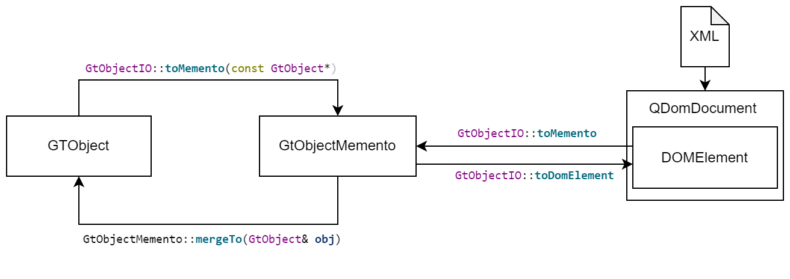

.. toctree::
   :maxdepth: 2

.. _concepts:

Data Modeling
=============

Objects
-------

Properties
----------

Properties are an important instrument to make member variables of data model classes visible in the
graphical user interface (GUI) of the GTlab framework and to enable data serialization.

Adding Properties
^^^^^^^^^^^^^^^^^

To extend a data model class with a property, there are some aspects to be considered.

Depending on the property type, a member variable should be added in the header files private section.

.. code-block:: cpp
   
   #include "gt_doubleproperty.h"
   
   class MyDataClass : public GtObject
   {
   ...
   private:
      GtDoubleProperty m_myDoubleProp;
   ...
   };

Furthermore, the member variable needs to be Initialized in the class constructor initializer list.
Please note that a property always requires the specification of an identification string and a name.
The identification string is required for the serialization functionality of the GTlab framework.
It should be short and unique. The name parameter appears in the graphical user interface of the
GTlab framework and should be user readable.

In order to ensure that the property can be recognized by the GTlab framework, the property must also
be registered using the registerProperty() function. By specifying an additional string, the property
can be assigned to a category. The categories are only visualized in the GUI. Properties with the same
category name will appear in the GUI under the same category. Without specifying a category,
the property is automatically assigned to the category "Main". The property category has no influence
on the serialization of the object and can be changed at any time without invalidating saved data.

.. code-block:: cpp
 
   MyDataClass::MyDataClass() 
   : m_myDoubleProp("doubleProp", "My Double Property")
   {
      registerProperty(m_myDoubleProp); // or registerProperty(m_myDoubleProp, "My Property Category")
   }

By properly adding a property to the data model class, the GTlab Framework can manage the associated
parameter autonomously. This includes the ability to serialize, deserialize and compare the property
with another data records.

The entry within the serialized record contains the property identification string, the data type and
the actual value of the property. With this information the IO system of GTlab is able to recreate the
serialized object state. Please note that the values of the properties are always stored in the SI-Unit system.

.. code-block:: xml

   <property name="doubleProp" type="double">106.2</property>

There are some functionalities that are independent of the property type:

Sub Properties
^^^^^^^^^^^^^^

Properties can be ordered in a hierarchical manner. For example, a child property can be added to a property
via GtAbstractProperty::registerSubProperty. The hierarchical structure has no influence on the serialization
of the object.

When registering the properties, please note that all subproperties must be added before the main property is
registered to the object.

.. code-block:: cpp

   m_ETAtype.registerSubProperty(m_ETAisMode);
   m_ETAtype.registerSubProperty(m_ETApolMode);
   
   registerProperty(m_ETAtype);

Read-only Properties
^^^^^^^^^^^^^^^^^^^^

A property can be configured so that a modification by the user is not possible.
However, this only affects the modification via the GUI.

To change the visibility of a property, use :cpp:func:`GtAbstractProperty::setReadOnly`.
See also :cpp:func:`GtAbstractProperty::isReadOnly()`.

Example:

.. code-block:: cpp

   m_myDoubleProp.setReadOnly(true);
   registerProperty(m_myDoubleProp);

Hidden Properties
^^^^^^^^^^^^^^^^^

A property can be configured so that the property is not displayed within the GUI.

See :cpp:func:`GtAbstractProperty::hide()` or :cpp:func:`GtAbstractProperty::isHidden()`.

Optional Properties
^^^^^^^^^^^^^^^^^^^

A property can be configured so that the property becomes optional.
As a result, besides the actual value of the property, an additional switch (active/inactive) is added.

See :cpp:func:`GtAbstractProperty::setOptional()`, :cpp:func:`GtAbstractProperty::isOptional()`,
:cpp:func:`GtAbstractProperty::setActive()` and  :cpp:func:`GtAbstractProperty::isActive()`.

Serialization API / Mementos
----------------------------

The Project
-----------

Calculators
===========

