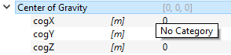
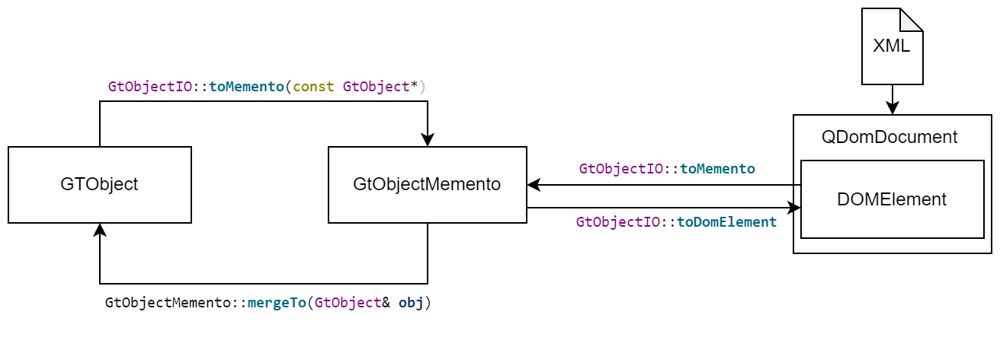

:tocdepth: 3

.. _concepts:

Data Modeling
=============

In GTlab, data modeling revolves around Objects and their associated properties.
Objects serve as the fundamental units of the data structure and contain properties that hold values and metadata.
Each Object is derived from :cpp:class:`GtObject`, which is a QObject, allowing it to leverage Qt’s signal-slot mechanism and hierarchical organization. 
Properties, encapsulated within :cpp:class:`GtAbstractProperty` objects, provide flexibility in handling various data types and units within GTlab’s data framework.

Objects
-------

Objects are the main ingredient to create data hierarchies and data models in GTlab.
They have many features under the hood that allows GTlab to access all objects in a uniform way.

The key characteristics of Objects are:

- Derived from :cpp:class:`GtObject`
- Support a parent-child hierarchy and can contain other Objects as children. The actual content of a Object (i.e., the data) is provided by its Properties.
- Each Object has an unique identifier (UUIDs) and can be referenced via its UUID or a hierarchical path.
- Automatic serialization, deserialization and change detection via :ref:`Object Mementos <Mementos>`.

Hierarchies and Relationship Management
^^^^^^^^^^^^^^^^^^^^^^^^^^^^^^^^^^^^^^^

Objects support an extensive parent-child hierarchy. This hierarchy facilitates efficient data modeling, where each Object can contain multiple children,
enabling complex, multi-layered structures. GTLab provides several methods for managing and navigating these hierarchies:

Query child objects by Type
"""""""""""""""""""""""""""

via :cpp:func:`GtObject::findDirectChildren()`, :cpp:func:`GtObject::findChildren()`,
:cpp:func:`GtObject::findDirectChild()` and :cpp:func:`GtObject::findChild()` directly of in a recursive way. Example:

.. code-block:: cpp
   
   // get the booster
   GtObject* booster = engine->findDirectChild<BoosterType*>();

   // get a specific booster defined by a name
   GtObject* booster2 = engine->findDirectChild<BoosterType*>("Booster2");

   // get all booster
   QList<BoosterType*> allBooster = engine->findDirectChilden<BoosterType*>();
   
To perform a recursive query, including sub-objects, replace ``findDirectChild`` with ``findChild`` etc.

Query child objects  by UUID or path
""""""""""""""""""""""""""""""""""""

To retrieve objects using unique identifiers (UUIDs) or hierarchical paths using both direct and recursive searches,
the functions :cpp:func:`GtObject::getObjectByUuid()` and :cpp:func:`GtObject::getObjectByPath()` are used.

Adding child objects
""""""""""""""""""""

Objects are added to the parent object via :cpp:func:`GtObject::appendChild` at the end of the object or at a specific position via :cpp:func:`GtObject::insertChild`

.. code-block:: cpp
   
   // create a booster
   GtObject* booster = new BoosterType();

   // note, engine becomes owner of booster. Thus no need to manually delete the booster object
   engine->appendChild(booster);

   // and another one
   GtObject* firstBooster = new BoosterType();

   // insert this object at position 0
   engine->insertChild(0, firstBooster);
   

Default vs. Non-Default Child Objects
^^^^^^^^^^^^^^^^^^^^^^^^^^^^^^^^^^^^^

**Non-Default Child Objects:**
Optional objects. Allthough they are also generated during object construction, non-default Objects can be deleted by the user or a project and thus cannot be
assumed to always exist.

**Default Child Objects:**
A mandatory object. A default child object is an object that will always exist within its parent.
In case a default object is missing in a project, it will be generated by GTlab in the Object constructor.
To make a Object default, call :cpp:func:`GtObject::setDefault`, e.g.

.. code-block:: cpp

   GtObject* booster = new BoosterType();
   booster->setDefault(true);
   ...

Ownership
^^^^^^^^^

- Objects in a hierarchy are always owned by their parent object and are therefore automatically deleted, if the parent is deleted.
- If a object is manually deleted, it will be removed from its parent.

Since ``GtObject`` is based on ``QObject``, it follows the same ownership model and semantics.
More information can be found in the Qt documentation https://doc.qt.io/qt-6/objecttrees.html.

Properties
----------

Properties are an important instrument to make member variables of data model classes visible in the
graphical user interface (GUI) of the GTlab framework and to enable data serialization.

Adding Properties
^^^^^^^^^^^^^^^^^

To extend a data model class with a property, there are some aspects to be considered.

Depending on the property type, a member variable should be added in the header files private section.

.. code-block:: cpp
   
   #include "gt_doubleproperty.h"
   
   class MyDataClass : public GtObject
   {
   ...
   private:
      GtDoubleProperty m_myDoubleProp;
   ...
   };

Furthermore, the member variable needs to be Initialized in the class constructor initializer list.
Please note that a property always requires the specification of an identification string and a name.
The identification string is required for the serialization functionality of the GTlab framework.
It should be short and unique. The name parameter appears in the graphical user interface of the
GTlab framework and should be user readable.

In order to ensure that the property can be recognized by the GTlab framework, the property must also
be registered using the registerProperty() function. By specifying an additional string, the property
can be assigned to a category. The categories are only visualized in the GUI. Properties with the same
category name will appear in the GUI under the same category. Without specifying a category,
the property is automatically assigned to the category "Main". The property category has no influence
on the serialization of the object and can be changed at any time without invalidating saved data.

.. code-block:: cpp
 
   MyDataClass::MyDataClass() 
   : m_myDoubleProp("doubleProp", "My Double Property")
   {
      registerProperty(m_myDoubleProp); // or registerProperty(m_myDoubleProp, "My Property Category")
   }

By properly adding a property to the data model class, the GTlab Framework can manage the associated
parameter autonomously. This includes the ability to serialize, deserialize and compare the property
with another data records.

The entry within the serialized record contains the property identification string, the data type and
the actual value of the property. With this information the IO system of GTlab is able to recreate the
serialized object state. Please note that the values of the properties are always stored in the SI-Unit system.

.. code-block:: xml

   <property name="doubleProp" type="double">106.2</property>

There are some functionalities that are independent of the property type:

Sub-Properties
^^^^^^^^^^^^^^

Properties can be ordered in a hierarchical manner in GTlab's user interface.
For example, a child property can be added to a property via :cpp:func:`GtAbstractProperty::registerSubProperty`.
The hierarchical structure has no influence on the serialization
of the object.

An example of sub-properties is shown in the following screenshot, where
the center of gravity property contains three sub properties - x,y,z:

.. note::

   When registering the properties, please note that all subproperties must be added before
   the main property is registered to the object.

   .. code-block:: cpp

      cog.registerSubProperty(cogX);
      cog.registerSubProperty(cogY);
      cog.registerSubProperty(cogZ);
      registerProperty(cog);

Read-only Properties
^^^^^^^^^^^^^^^^^^^^

A property can be configured so that a modification by the user is not possible.
However, this only affects the modification via the GUI.

To change the visibility of a property, use :cpp:func:`GtAbstractProperty::setReadOnly`.
See also :cpp:func:`GtAbstractProperty::isReadOnly()`.

Example:

.. code-block:: cpp

   m_myDoubleProp.setReadOnly(true);
   registerProperty(m_myDoubleProp);

Hidden Properties
^^^^^^^^^^^^^^^^^

A property can be configured so that the property is not displayed within the GUI.

See :cpp:func:`GtAbstractProperty::hide()` or :cpp:func:`GtAbstractProperty::isHidden()`.

Optional Properties
^^^^^^^^^^^^^^^^^^^

A property can be configured so that the property becomes optional.
As a result, besides the actual value of the property, an additional switch (active/inactive) is added.

See :cpp:func:`GtAbstractProperty::setOptional()`, :cpp:func:`GtAbstractProperty::isOptional()`,
:cpp:func:`GtAbstractProperty::setActive()` and  :cpp:func:`GtAbstractProperty::isActive()`.

.. _Mementos:

Serialization API / Mementos
----------------------------

The Project
-----------
