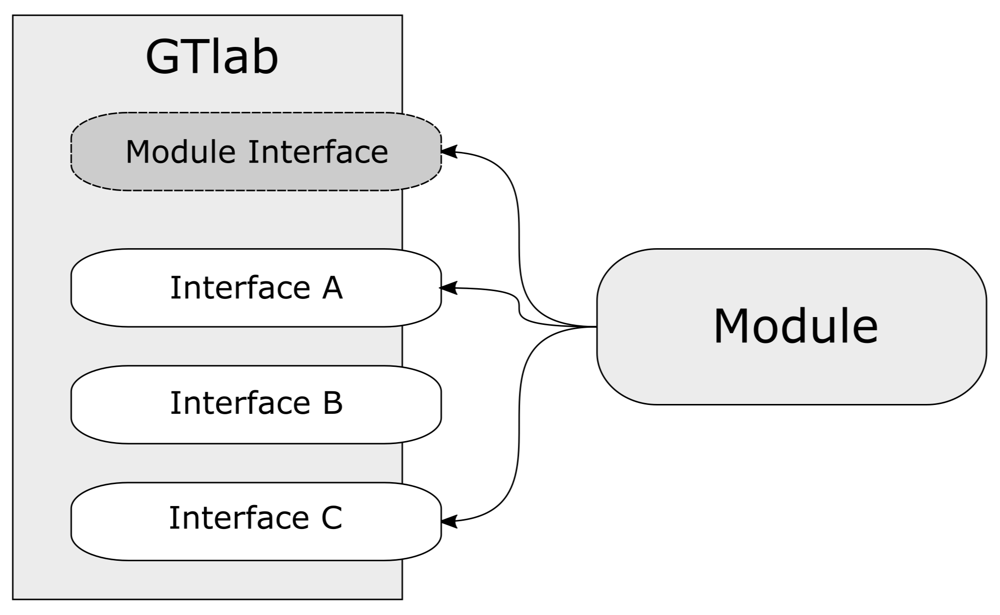

Interfaces
==========

GTlab discovers a module's capabilities through Qt interfaces. Every module
implements :cpp:class:`GtModuleInterface`; additional interfaces are optional
and should be selected from the user-facing features the module contributes.
You do not need to implement interfaces for functionality the module does not
provide.

  One plugin entry point can implement several independent capabilities.

Choose interfaces by feature
----------------------------

.. list-table:: Common module capabilities
   :widths: 25 35 40
   :header-rows: 1

   * - Interface
     - Use it when the module provides
     - Registration result
   * - :ref:`moduleinterface`
     - Any GTlab module
     - Identity, version, description, and optional module-wide hooks
   * - :ref:`datamodelinterface`
     - Persistent domain objects and, optionally, its own project package
     - Package and object-class metadata
   * - :ref:`processinterface`
     - Calculators or workflow tasks
     - Calculator and task descriptors
   * - :ref:`mdiinterface`
     - Object editors, viewers, dock widgets, or post-processing views
     - GUI class metadata and object-to-UI mappings
   * - :ref:`importerinterface`
     - Actions that read external files into selected objects
     - Importer class metadata
   * - :ref:`exporterinterface`
     - Actions that write selected objects to external files
     - Exporter class metadata

Start with the smallest combination that represents the feature. For example,
a headless calculation module may need only the module and process interfaces;
a domain module with stored objects and editors commonly combines the module,
data-model, and MDI interfaces.

Implement an optional interface
-------------------------------

An optional interface follows the same pattern:

.. code-block:: cpp

  class MyModule : public QObject,
                   public GtModuleInterface,
                   public GtProcessInterface
  {
      Q_OBJECT
      GT_MODULE()
      Q_INTERFACES(GtProcessInterface)

  public:
      GtVersionNumber version() override;
      QString description() const override;
      QList<GtCalculatorData> calculators() override;
  };

The important pieces are:

* public inheritance makes the interface API available;
* ``Q_INTERFACES`` lets Qt and GTlab discover each optional interface;
* the registration function returns descriptors or ``QMetaObject`` values for
  the contributed classes; and
* the target links the GTlab component declaring those types.

``GT_MODULE()`` already registers :cpp:class:`GtModuleInterface`; do not add a
second ``Q_INTERFACES(GtModuleInterface)`` declaration. Registration functions
should describe available types, not create long-lived application objects.
GTlab creates registered objects when the corresponding feature is used.

Interface compatibility
-----------------------

Qt records an interface identifier and version in the plugin. GTlab rejects a
module when an interface was compiled against an incompatible version, even if
the C++ class has the same name. Build and test modules against the same GTlab
major/minor line used at runtime, and rebuild after changing that dependency.

The interfaces under :doc:`interfaces/advanced` integrate specialized
subsystems. Add them only when the relevant basic feature is already working.

.. toctree::
   :maxdepth: 1
   :hidden:

   interfaces/module
   interfaces/datamodel
   interfaces/process
   interfaces/mdi
   interfaces/importer
   interfaces/exporter
   interfaces/advanced
