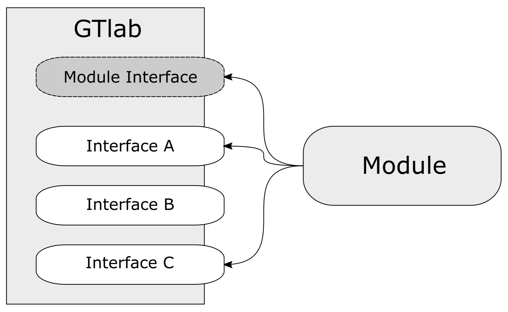

About Modules
=============

GTlab has a plugin-based architecture that allows for application extension through dynamic loading.
A "GTlab module"  serves this purpose - extending its functionalities beyond what's provided by the GTlab core framework
itself without altering the core framework and can integrate new functionalities, such as new data models,
data editors and viewers, process and workflow elements etc.
In fact, without any modules, GTlab's functionality is very limited for practical use.

The different aspects to extends GTlab's functionality are realized by implementing 
one or more of GTlab's well defined interfaces in a module.

GTlab modules are strictly structured using the `Qt <https://doc.qt.io/qt-6/plugins-howto.html#the-low-level-api-extending-qt-applications>`_ low-level API for extending Qt applications.
