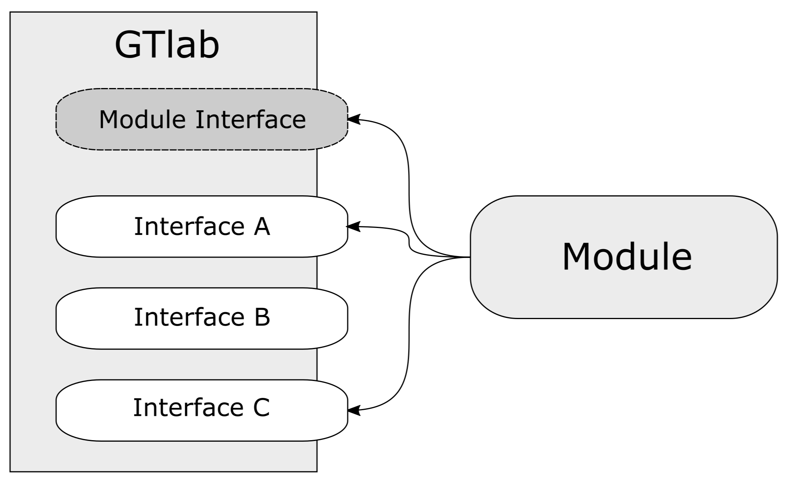

Interfaces
==========

GTlab's extensibility is achieved through a set of interfaces that each module can implement.
There are many different interfaces in GTlab, each for a different purpose. 
As an example, the data model interface allows to define data models for the project structure.
On the other hand, the MDI interface allows to customize the user interface for the data model objects including writing custom editors.

Thus, a module typically implements a couple of different interfaces, but not necessarily all, as depicted in the following figure.

The most important interface is :cpp:class:`GtModuleInterface`, as this is the main entry point of each module.
This needs to be implemented by all modules, such that they can be recognized by GTlab.
A module though does not need a main() function, in camparison to standalone executables.

This is the list of all interfaces, GTlab modules can implement:

.. list-table:: GTlab's basic interfaces
   :widths: 30 70
   :header-rows: 1

   * - Interface
     - About
   * - :ref:`moduleinterface`
     - The main entry point for a GTlab module.
   * - :ref:`datamodelinterface`
     - Used to define custom data objects and object hierarchies.
   * - :ref:`processinterface`
     - Used to define process elements such as calculators and tasks.
   * - :ref:`mdiinterface`
     - Used to customize the GTlab GUI, i.e. editors or custom actions for objects.
   * - :ref:`importerinterface` and :ref:`exporterinterface`
     - Used to implement importer and exporter of specific objects.

.. toctree::
   :maxdepth: 1
   :hidden:

   interfaces/module
   interfaces/datamodel
   interfaces/process
   interfaces/mdi
   interfaces/importer
   interfaces/exporter
   interfaces/advanced
