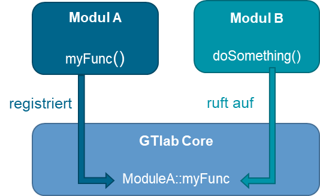

Shared Functions
================

Using the feature "shared functions", a GTlab Module can use functions of other modules
without the need to compile against the other module. Shared functions have the multiple benefits:

- Use of functions provided by other modules
- Use of shared functions from python scripting
- They are provided during **runtime** by the core framework.
- There is no module-module dependency during the **compile time**.

The basic principle is shown the following image:

Writing shared functions
------------------------

The class :cpp:class:`GtModuleInterface` has been extended by the method :cpp:func:`GtModuleInterface::sharedFunctions`,
where a module can return its shared functions. But how to do it? What is a ``gt::SharedFunction``?

The easiest way to write a shared function is to wrap an existing (non-shared) function.
Lets assume we have the following function to compute a sum:

.. code-block:: cpp

    // In ModuleA
    static int my_test_sum(int a, int b)
    {
        return a + b;
    }

This function can now be converted into a shared function and registered as follows

.. code-block:: cpp

    QList<gt::SharedFunction>
    ModuleA::sharedFunctions() const
    {
        gt::SharedFunction sharedFunction = gt::interface::makeSharedFunction(
            "my_test_sum",      // The name the function will be registered at the framework
            my_test_sum,        // the function "pointer"
            "Returns the square of x.\nSignature: " + // provide an optional description
            gt::interface::getFunctionSignature(my_test_sum) // the signature can be deduced automatically
        );
    
        return {sharedFunction};
    }

How does it work? :cpp:func:`gt::interface::makeSharedFunction` wraps the upper function into a new function with the following shared function signature

.. code-block:: cpp

    QVariantList function(const QVariantList& args)

This implies, that all arguments of the function to be wrapped need to be convertible into ``QVariant``.
``makeSharedFunction`` checks at runtime, that the number of arguments passed to the function is correct, and that all argument types are as expected.

``makeSharedFunction`` performs some magic behind the scenes, but it can be summarized as

- It converts a regular function (or a function object or a lambda) into a shared function
- It checks the arguments passed by the user, i.e. checks the correct argument number and types
- It adds an description if none was provided. It will deduce the function signature automatically (using :cpp:func:`gt::interface::getFunctionSignature`)
- Sometimes, the automatically generated conversion code might not work as expected.
  In this case, the shared function can also be defined using the upper function signature as follows.

Creating a shared function - the advanced way
---------------------------------------------

Sometimes, the automatic of a regular function is not desired and the developer wants to have precise control.
This can be achieved by implementing a shared function manually.
Simply said, the user needs to provide a function with the shared function signature, i.e. ``QVariantList function(const QVariantList& args)``.
Here's an example of the upper sum function wrapped manually into a shared function.

.. code-block:: cpp

    QVariantList mySharedSum(const QVariantList& args)
    {
        if (args.size() != 2)
        {
            // error, number of arguments incorrect
            return {};
        }
        
        bool ok = true;
        
        // get argument a
        double a = args[0].toDouble(&ok);
        if (!ok)
        {
            // error: first argument is not a double value
            return {};
        }
        
        // get argument b
        double b = args[1].toDouble(&ok);
        if (!ok)
        {
            // error: second argument is not a double value
            return {};
        }
        
        double sum = my_test_sum(a + b);
        return QVariantList({sum});
    }

If this function signature is used, no automatic conversion will be done and the function is responsible for checking all arguments.

Then, the function can be registered as above, i.e.

.. code-block:: cpp

    QList<gt::SharedFunction>
    ModuleA::sharedFunctions() const
    {
        gt::SharedFunction sharedFunction = gt::interface::makeSharedFunction(
            "mySharedSum",      // The name the function will be registered at the framework
            mySharedSum,        // the function "pointer"
            "Returns the square of x.\nSignature int my_test_sum(int a, int b)"
        );
    
        return {sharedFunction};
    }

Using shared functions
----------------------

.. code-block:: cpp

    // query the function from gtlab
    auto function = gt::interface::getSharedFunction("<GT_MODULE_ID>", "my_test_sum");
    
    // check, that the function exists
    if (!function.isNull())
    {
        // call the function and compute the sum
        auto returnValues = function({1, 2});
        // make sure the return type is as expected
        assert(returnValues.size() == 1);    
        // result is 3.0
        double result = returnValues[0].toDouble();
    }