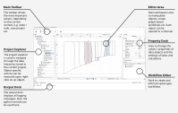
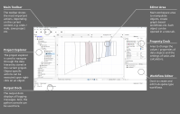
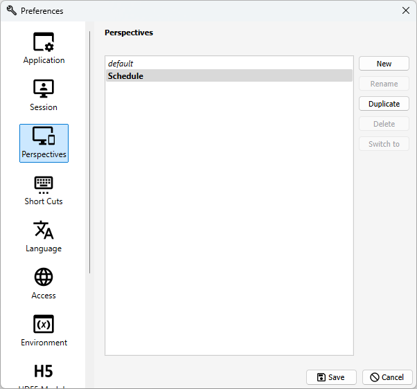

User Interface
==============

Dock Widgets
------------

GTlab uses the **dock widgets** concept to organize its interface. Dock widgets are secondary windows that can be arranged around the central GTlab workspace.

Dock widgets can be:

- Moved within their current area
- Repositioned into a new dock area
- Detached (floating) anywhere on the screen

Each dock widget consists of:

- A **title bar**
- A **content area**

You can reposition or undock a widget by dragging its title bar to a new location. To close a widget, click the **X** button on its title bar.

If a dock widget has been hidden, you can restore it via ``Window → Dock Widgets``

.. _label_project_explorer:

Project Explorer
~~~~~~~~~~~~~~~~

The **Explorer** dock widget shows the :ref:`project structure <label_chapter_projects>` of the current :ref:`session <label_section_sessions>`.
There can be several projects, of which only one can be opened at a time.
The entire hierarchical model structure of the open project is visualized in a tree structure.

.. _label_property_dock:

Property Dock
~~~~~~~~~~~~~

The corresponding :ref:`properties <label_section_properties>` of a data object are displayed in the **Properties** dock widget for a selected object in the GTlab model (e.g. an object selected in the `Project Explorer`_ or a workflow element).
Most properties may be edited here directly.
Depending on the object, its properties may be organized in multiple tabs.

.. _label_output_dock:

Output Dock
~~~~~~~~~~~

The **Output** dock widget primarily holds two tabs. The *Application* tab shows the logging output in GTlab.
More on this in the Logging_ section.
The *Python Console* tab allows you to interact with the Python instance to issue commands and displays Python-scripting related messages.
More on this in the section :ref:`Python Console <label_python_console>`.

.. _label_section_logging:

Logging
"""""""

GTlab uses a logging system to display messages in the Output dock In the *Application* tab which are generally relevant to the user.

Each message is displayed with a logging level, time and an ID. The ID indicates which part or module of GTlab sent the message.

The possible logging levels are explained below. Not all levels are relevant for the average user but are aimed at developers of GTlab and its modules.

+------------+---------------------------------+---------------------------------------------------------------------------------------------------------------------+
| Category   | Icon                            | Description                                                                                                         |
+============+=================================+=====================================================================================================================+
| Trace      | |trace_bright| |trace_dark|     | Generally only used by developers as a hint for code development.                                                   |
+------------+---------------------------------+---------------------------------------------------------------------------------------------------------------------+
| Debug      | |debug_bright| |debug_dark|     | Generally only used by developers as a hint for code development.                                                   |
+------------+---------------------------------+---------------------------------------------------------------------------------------------------------------------+
| Info       | |info_bright| |info_dark|       | General information about processes and actions intended for the user.                                              |
+------------+---------------------------------+---------------------------------------------------------------------------------------------------------------------+
| Warning    | |warning_bright| |warning_dark| | Indicates issues in the setup of worklfows or misconfigurations that should be addressed by the user.               |
+------------+---------------------------------+---------------------------------------------------------------------------------------------------------------------+
| Error      | |error_bright| |error_dark|     | Indicates critical errors that need attention of the user and may indicate that actions aborted.                    |
+------------+---------------------------------+---------------------------------------------------------------------------------------------------------------------+
| Fatal      | |fatal_bright| |fatal_dark|     | Indicates unrecoverable errors that may lead to the termination of the application.                                 |
+------------+---------------------------------+---------------------------------------------------------------------------------------------------------------------+

The logging levels may be filtered using the filter icon in the logging level column.

The logging level of the application may be changed in the selection box in the top right of the Output dock.
All messages from the lower logging level are not logged at all.
When launching GTlab in its default configuration, the logging messages indented for
developer only of the logging levels *Trace* and *Debug* are not logged.

Further buttons in the bottom right-hand corner allow you to clear all logged messages or export the output log to a text file.

Individual messages may be filtered using the search bar of the Output dock or by pressing ``Ctr+F``.

.. _label_section_processdock:

Process Dock
~~~~~~~~~~~~

The **Process** dock widget is for the coordination of workflows (of the :ref:`hub-spoke architecture <label_hub_spoke>`).

Instructions for creating and starting new workflows can be found :ref:`here <label_section_how_to_build_process>`.

Workflows are grouped user-specifically in GTlab.
The workflow grouping currently displayed can be changed using the drop-down menu at the top of the window.

Editor Area
-----------

The **Editor Area** is GTlab’s main working space and displays all open editors.

In the default mode, you can switch between open editors using tabs.
Many editors also provide a printing function, accessible from their toolbar.

Depending on the installed modules and selected objects, GTlab offers different types of editors and viewers, for example:

- A graph-based workflow editor (from the :ref:`IntelliGraph Module <label_chapter_graph_workflows>`)
- An editor for modeling aircraft engine performance
- A 2D sketching editor
- A 3D geometry viewer
- An editor for displaying tabular data
- …

Toolbars
--------
GTlabs toolbar uses a adaptive design to offer buttons depending on possible option based on the shown windows done actions.

.. _label_section_perspectives:

Perspectives
------------

The dock-widget implementation allows to customize which dock widgets are active and and where each dock widget is positioned.

Depending of the workflow of the user, different dock-widget arrangements may be required.

Perspectives allow to save the layout of the widgets and provide a simple way to switch between different layouts.

Creating a perspective
~~~~~~~~~~~~~~~~~~~~~~

To create a new perspective in GTlab:

1. Open the perspective settings via
   ``Window → Edit Perspectives``
2. Click *New* to create a perspective
3. Rename the perspective (Optional)
4. Press *Save* to confirm

Toggling perspectives
~~~~~~~~~~~~~~~~~~~~~

By default, you can toggle between perspectives by pressing ``Alt+P``.
This shortcut can be customized in the **Shortcut Settings** page in the :ref:`Preferences <label_chapter_preferences_shortcuts>`.

To switch directly to a specific perspective activate ``Window → Show Perspective`` and choose the desired perspective from the list.