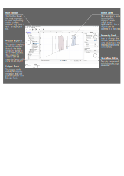

User Interface
==============

Docks
-----

GTlab uses the **dock widgets** concept to organize its interface. Dock widgets are secondary windows that can be arranged around the central GTlab workspace.

Managing Dock Widgets
^^^^^^^^^^^^^^^^^^^^^

Dock widgets can be:

- Moved within their current area  
- Repositioned into a new dock area  
- Detached (floating) anywhere on the screen  

Each dock widget consists of:

- A **title bar**  
- A **content area**  

You can reposition or undock a widget by dragging its title bar to a new location. To close a widget, click the **X** button on its title bar.

Restoring Hidden Dock Widgets
^^^^^^^^^^^^^^^^^^^^^^^^^^^^^

If a dock widget has been hidden, you can restore it via:

``Window → Dock Widgets``

.. _label_project_explorer:

Project Explorer
----------------
This dock widget shows the :ref:`project structure <label_chapter_projects>` of the current :ref:`session <label_section_sessions>`. There can be several projects, of which a maximum of one can be open.
The entire hierarchical model structure of the open project is visualized in a tree structure.
 
.. _label_property_dock:

Property Dock
-------------
The corresponding :ref:`properties <label_section_properties>` are displayed in this dock widget for a selected object in the GTlab model (e.g. an object of the model in the `Project Explorer`_ or a work flow element).
Depending on the object, the properties can also be displayed in several tabs in this window.

.. _label_output_dock:
Output Dock
-----------
The *Output* widget primarily holds two tabs. The *Application* tab shows the logging output in GTlab. More on this in the Logging_ section.  
The *Python Console* tab allows you to interact with the Python instance to receive messages from the Python interaction with GTlab as well as to use Python commands in GTlab.
More on this in the section :ref:`Python Console <label_python_console>`.

.. _label_section_processdock:

Process/Calculators
^^^^^^^^^^^^^^^^^^^
The *Process/Calculators* widget is for the coordination of workflows (of the :ref:`hub-spoke architecture <label_hub_spoke>`).

Instructions for creating and starting new workflows can be found :ref:`here <label_section_how_to_buid_process>`.

Workflows are grouped user-specifically in GTlab.
The workflow grouping currently displayed can be changed using the drop-down menu at the top of the window.

Editor Area
-----------

The **Editor Area** is GTlab’s main working space and displays all open editors.

Managing Editors
^^^^^^^^^^^^^^^^

In the default mode, you can switch between open editors using tabs.  
Many editors also provide a **printing function**, accessible from their toolbar.

Available Editors
^^^^^^^^^^^^^^^^

Depending on the installed modules and selected objects, GTlab offers different types of editors and viewers, for example:

- A graph-based workflow editor (from the **GTlab IntelliGraph Module**)  
- An editor for modeling aircraft engine performance  
- A 2D sketching editor  
- A 3D geometry viewer  
- An editor for displaying tabular data  
- …  

.. _label_section_logging:

Logging
-------
GTlab uses a logging system which is displayed in the Output window.
In the *Application* tab, all logging messages that are issued in the system are collected, both from the main application and from modules.

Each message is displayed with its category and information on the ID and time. The ID indicates which part of the programme sent the message.

The possible categories are explained below; not all of them are relevant for users of the software, but some are aimed at developers.

+------------+---------------------------------+---------------------------------------------------------------------------------------------------------------------+
| Category   | Icon                            | Description                                                                                                         |
+============+=================================+=====================================================================================================================+
| Trace      | |trace_bright| |trace_dark|     | Only for developers: Hint for code development                                                                      |
+------------+---------------------------------+---------------------------------------------------------------------------------------------------------------------+
| Debug      | |debug_bright| |debug_dark|     | Only for developers: Hint for code development                                                                      |
+------------+---------------------------------+---------------------------------------------------------------------------------------------------------------------+
| Info       | |info_bright| |info_dark|       | General information about the process, useful for understanding the system’s normal operation.                      |
+------------+---------------------------------+---------------------------------------------------------------------------------------------------------------------+
| Warning    | |warning_bright| |warning_dark| | Indicates potential issues or situations that might lead to problems if not addressed.                              |
+------------+---------------------------------+---------------------------------------------------------------------------------------------------------------------+
| Error      | |error_bright| |error_dark|     | Indicates critical errors that need attention of the user and may impact or interrupt the workflow’s functionality. |
+------------+---------------------------------+---------------------------------------------------------------------------------------------------------------------+
| Fatal      | |fatal_bright| |fatal_dark|     |  Unrecoverable errors that lead to the termination of the application.                                              |
+------------+---------------------------------+---------------------------------------------------------------------------------------------------------------------+

The categories can be filtered. To do this, select or deselect the buttons in the bottom right-hand corner. A general preselection can be made via the
drop-down menu in the top right-hand corner. It also modifies the generally displayed logging level. In *Default* mode, for example, the logging messages relevant only for
developer relevant logging messages of the categories *Trace* and *Debug* are not displayed.

Further buttons in the bottom right-hand corner allow you to remove all output or export it to an external text file.

Individual messages can be filtered using the search window in the lower part of the window.

   

   

   

   

   
.. |error_bright| image:: images/logging_error_bright.png
   :align: middle
   :width: 16
   :alt: Error
   :class: only-light
   

   

   

Toolbars
--------
GTlabs toolbar uses a adaptive design to offer buttons depending on possible option based on the shown windows done actions.

.. _label_section_perspectives:

Perspectives
------------

The dock-widget concepts allow to customize which and where the dock widgets are positioned.

Depending of the current work of the user, different dock widgets are required, others aren't.

Perspectives allow to save the layout of the widgets and provide an easy way to switch between different perspectives.

Creating a perspective
^^^^^^^^^^^^^^^^^^^^ 

To create a new perspective in GTlab:

1. Open the perspective settings via  
   ``Window → Edit Perspectives``  
2. Click **New** to create a perspective  
3. (Optional) Rename the perspective  
4. Press **Save** to confirm  

Toggling perspectives
^^^^^^^^^^^^^^^^^^^^^

By default, you can toggle between perspectives by pressing **ALT+P**.  
This shortcut can be customized in the **Shortcut Settings** page.

To switch directly to a specific perspective:  

``Window → Show Perspective``  

and choose the desired perspective from the list.  