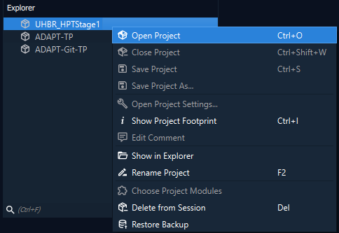
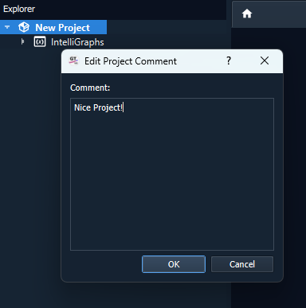

.. _label_chapter_projects:

Projects
========

In GTlab, work is organised in the form of projects. 
This means that a project contains all data, both for the modelling of objects and systems, as well as all information on workflows etc.. 
They are therefore the superordinate element of data handling.

The following section shows how to create new projects, change or delete projects, but also how the data is organised within a project and how it can be handled.

Project Handling
----------------

Create a new project
^^^^^^^^^^^^^^^^^^^^
To set up a new project in your current session, use the *New Project Wizard*.

Start the wizard from the menu *File → New Project* or via the toolbar. The wizard will guide you step by step through the required settings.

On the *Project Specifications* page, enter a project name (*Name*) and choose a storage location (*Directory*) on your hard disk.

The project name must be unique within the session. In addition, you cannot select a directory that already contains a GTlab project file.

On the *Project Modules* page, select the modules relevant to your project. Only modules with a valid data model are available for selection.

Click *Next* to confirm your selection. To finalize the setup, choose *Finish* on the *Import Data* page.

Add specific package to a project
^^^^^^^^^^^^^^^^^^^^^^^^^^^^^^^^^
When creating projects, you are already asked which packages should be part of the project data. 
This can be changed later using the **Choose Project Modules** entry in the `Context menu`_.

.. _label_section_sessions:

Sessions
^^^^^^^^
Sessions are an easy way to sort projects. Selecting the current session or creating new sessions etc. is possible in the :ref:`preferences <label_chapter_preferences_session>`.
Any number of projects can be collected in a session, whereby only one project can be open at a time.

Project Explorer
----------------

The *Project Explorer* displays all project data sets in a tree structure. The top level shows the projects of the active session.

Closed projects are marked with a specific symbol, while open projects are marked with another symbol. Only one project can be open in a GTlab instance at a time. To work with multiple projects, you must open additional GTlab instances. Copying data between instances is supported.

The context menu (right‑click) adapts depending on whether a project is open or closed. For example:

- *Open Project*: Opens a project. If another project is already open, it will be closed automatically.
- *Rename Project*: Renames a closed project without changing its file path.
- *Delete from Session*: Removes a closed project from the active session (optionally deleting it from disk).
- *Show in Explorer*: Opens the project’s folder in the file explorer.

Modules can be added or removed later using *Choose Project Modules* from the context menu. Projects can be saved or closed with *Save Project*, *Save Project As…*, or *Close Project*.

The data sets of the modules linked to a project appear as sub‑entries in the tree. Their structure matches the module’s data model and may include models, geometry, or results. Use *Ctrl+F* to filter the data sets.

When selecting a data set object, its properties are shown in the *Properties* dock widget. Changes to objects are indicated with symbols and color coding:

- Modified objects are highlighted in blue with a change symbol.
- Newly added objects appear in green with a plus symbol.
- Once the project is saved, symbols and colors reset.

Project Comments
^^^^^^^^^^^^^^^^
GTlab offers the option of adding a text comment to a project.
You can access the editor via the **Edit Comment** entry in the `Context menu`_.

   

If a comment is stored, this is indicated by a small speech bubble icon next to the project name and the comment appears as a tooltip when the mouse is held over this icon.

Project Settings
^^^^^^^^^^^^^^^^
The *Project Settings* dialog can be accessed via the `Context menu`_ of a project in the Explorer.

Footprint Information
^^^^^^^^^^^^^^^^^^^^^
The *Footprint Information* dialog can be accessed via the `Context menu`_ of a project in the Explorer.

Context menu
^^^^^^^^^^^^

The context menu of a project is the access point for many of the actions mentioned and for others.

.. list-table::
   :header-rows: 1
   :widths: 30 70

   * - Action
     - Description
   * - **Open Project** 
     - Opens a clodes project.
   * - **Close Project**
     - Closes an open project.
   * - **Save Project**
     - Saves the current state of the project.
   * - **Save Project As...** 
     - Saves the current project at a different location with a different name and opens this copy in the explorer.
   * - **Open Project Settings...**
     - Opens the dialog of the `Project Settings`_.
   * - **Show Project Footprint** 
     - Opens the dialog of the `Footprint Information`_.
   * - **Edit Comment**
     - Opens the dialog to edit `Project Comments`_.
   * - **Show in Explorer**
     - Opens the folder in the computer file system containing the project file.
   * - **Rename Project**
     - Opens a dialog to rename a project. Only possible for closed projects.
   * - **Choose Project Modules**
     - Opens selection editor for the module based Packages_ which should be used in the project.
   * - **Delete from Session**
     - Deletes project from session. Only possible for closed projects. The following dialog also offers the option of removing the project completely from the computer.
   * - **Generate Backup**
     - Generates a backup.
   * - **Restore Backup**
     - Opens the dialog to restore a backup. Only possible if at least one backup of the project exists.

Project Data
------------

Packages
^^^^^^^^
Packages are elements of the first level in the project data structure, directly below the project element itself.
These usually represent a data node specific to a use case, which is usually provided via the implementation in a module.
However, this does not mean that each module provides its own data model node, 
nor does it mean that you cannot use the options of a module (e.g. its workflow elements) if you do not also activate the package in the project.

.. _label_section_properties:

Properties
^^^^^^^^^^
In GTlab, the properties of data model objects and thus also workflow elements can be described using a large selection of properties. 
The properties can be of many different types, e.g. as numerical values, texts, path specifications to files, object references and many more.

Brief explanations of some more specific elements and features follow.

Object Selection
""""""""""""""""
Object references play an important role in the properties and settings of workflow elements in particular, but also in the project data model. Processes often require data records or data objects on the basis of which simulations are carried out, for example.

There is a separate dialog for this in the properties of elements that work via such a reference.

   

Such a property shows the value "-" if it is not yet set. Clicking on the button with the three dots (...) opens the dialog for selecting an object that is to be referenced.
Depending on the purpose of the reference, only the selection of meaningful objects is possible in this object.

Clicking on the broom symbol resets the reference. The button with the curved arrow allows the object referenced here to be selected in the Explorer widget.  

Unit System
"""""""""""
Many properties of data model elements are described using floating point numbers. 
GTlab supports a system of units for these. This means that you can switch between the usual units for the parameter. 
For example, temperatures are specified in the SI unit *K* (Kelvin), but can also be switched to *°C* (Celsius) via the user interface.
This can be done by clicking on the unit.
If different options are available, a drop-down menu opens from which an alternative unit can be selected.
If the unit is changed, the corresponding numerical value is automatically converted.
The units used are not saved, so the unit is always switched back to the SI unit when the selection of the object with the property is cancelled.
