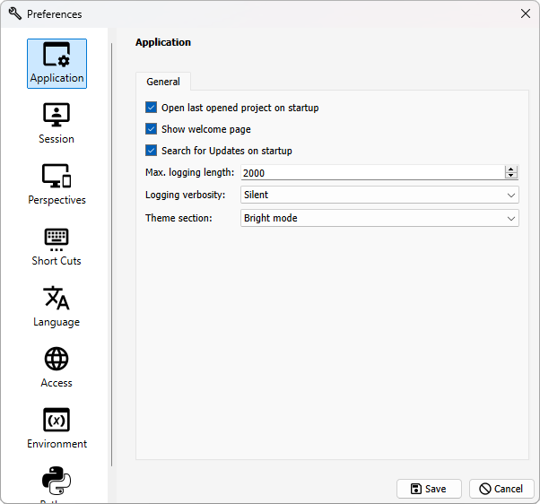
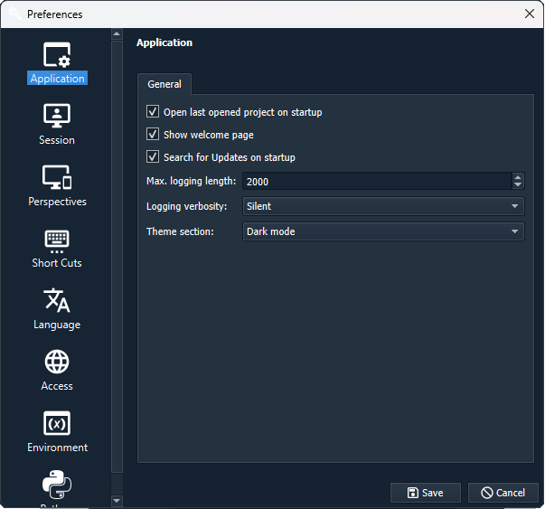
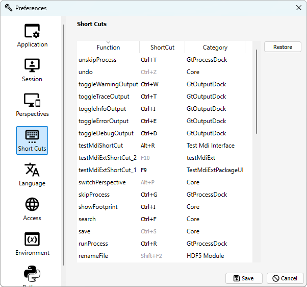
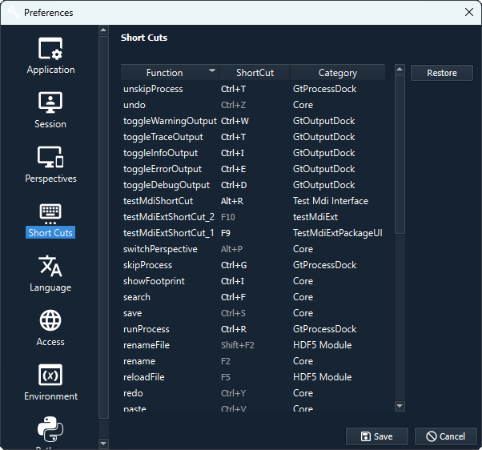
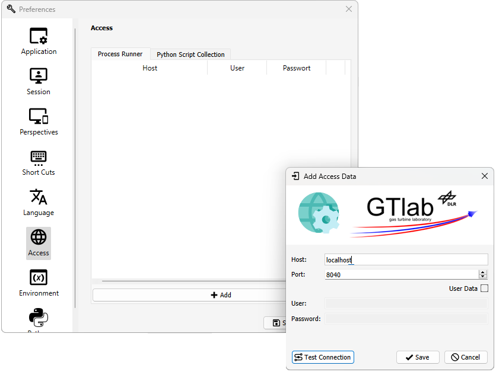
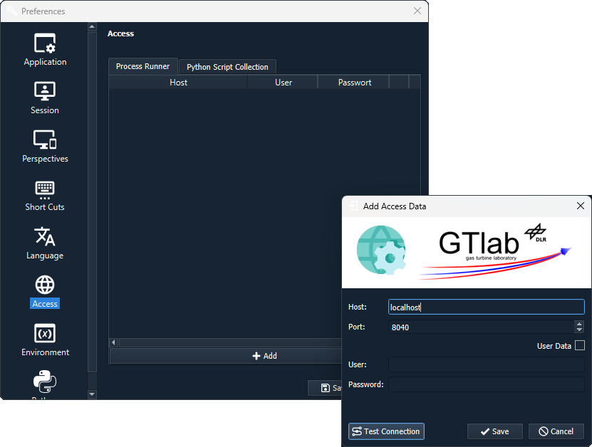

.. _label_chapter_preferences:

Preferences
===========

The preferences allow you to make various settings for your own GTlab instance on the computer.
These are sorted into different categories and are also specifically extended by some modules.

You can access the window for setting the preferences by selecting *Preferences* in the menu bar under *Edit* or with the short cut *Alt-Enter*.
    
Application  
-----------
  
Here are some general properties to set for the use of GTlab.  
  

- *Open last opened project on startup*  

  If this is not active, the current session is loaded but no project is opened yet.

- *Show welcome page*  
   
  The welcome page is loaded when GTlab is opened.

- *Search for Updates on startup*  
   
  If Internet access is possible, the system checks whether updates are available for the framework or modules. If this is the case, this is indicated by a message in the menu bar.

- *Max. logging length*  

  The :ref:`logging <label_section_logging>` output is limited in GTlab for reasons of efficiency. This limit can be modified here. The default value is 2000. 

- *Logging verbosity*  
   
  There are three modes: *Silent*, *Medium* and *High*. These both define filter levels for a range of messages in logging. Details can be found :ref:`here <label_section_logging>`.

- *Theme selection*	 
   
  There are three modes: *System selection*, *Bright* and *Dark*. GTlab is displayed in a bright or dark mode depending on the selection.

.. _label_chapter_preferences_session:

Session  
-------

New :ref:`sessions <label_section_sessions>` can be created, renamed, duplicated or deleted in this selection window. You can also select a session to use it.
The currently selected session is highlighted in bold.
Unlike the other sessions, the currently selected session cannot be renamed or deleted, nor can it be added to the current session because it already is.

Perspectives  
------------

New :ref:`perspectives <label_section_perspectives>` can be created, renamed, duplicated or deleted in this selection window. You can also select a perspective to use it.

The currently selected perspective is highlighted in bold.
Unlike the other sessions, the currently selected perspective cannot be renamed or deleted, nor can it be added to the current perspective because it already is.

Short Cuts  
----------

A number of short cuts are available for use in GTlab and are displayed on this page of the preferences.
Please note that a number of the short cuts can be personalised, the greyed out ones cannot be modified.

The default settings can be restored using the *Restore* button.
Some shortcuts are limited in their effect to the windows to which they are assigned and are only effective if these are also selected.

Language  
--------
Currently, no other language is supported besides English.

Access  
------

For various features in GTlab, it may be necessary to register access to tools or resources on servers.
These can be managed on the *Access* page.
These are organised in individual tabs for different uses (e.g. for Process Runner or Collection access).

A new connection can be registered using the + button. The host and port must be specified.  
The connection can be checked via *Test Connection*.
If necessary, access data can also be stored if this is required for access.

Environment  
-----------
GTlab, but in particular the modules that are used, can register GTlab internal environment variables. These are not to be confused with environment variables of the computer system.
They are often used, for example, to permanently store local paths to external programmes for the local GTlab instance.
The variables can be set accordingly in this menu.

Module specific extensions  
--------------------------

Some modules add their own pages in the preferences to enable specific settings.
One example of this is the Python module. The use of the preferences settings is explained further :ref:`in the section on scripting <label_chapter_scripting2>`.
