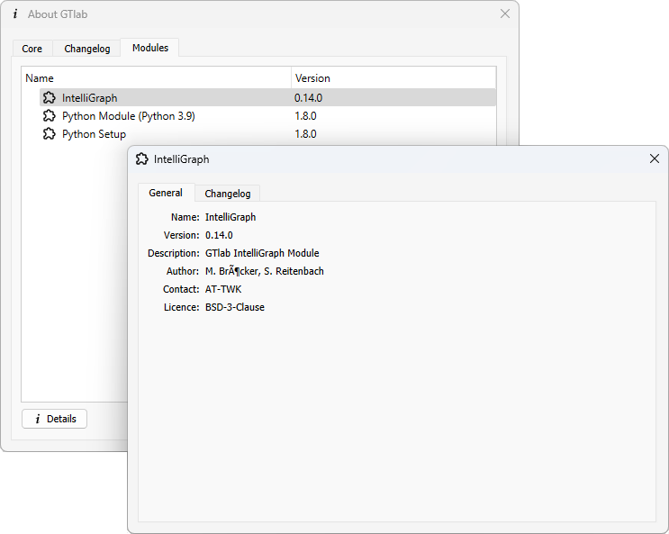
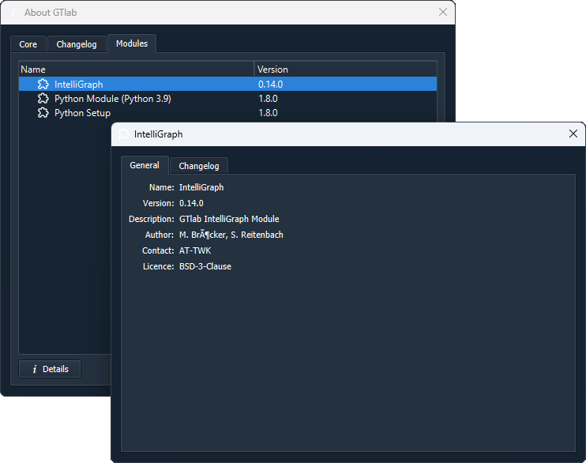

About Page
==========

The About page provides an overview of some information about the GTlab instance that is currently being used.
Version information in particular, but also the changelog are provided here.

The About page can be accessed via the menu. Under the *Help* entry, select the *About GTlab* entry.
It is also possible to go directly to the About page with the overview of the modules via the short cut *Alt + M*.

The window is organised with three tabs. If GTlab is started in developer mode, other overviews that are not relevant for normal use are displayed.

Core
----
The version of GTlab currently in use is displayed on this start page of the window.
There is also a link at the bottom left to the folder in which all licence files belonging to the application are located.
At the bottom right, the *Export Framework Footprint* button allows you to export an overview of the currently used programme components (framework and modules), including their version number, as an .mxl file.

Changelog
---------
Here is an overview of the GTlab changelog.
Initially, this is given in a shortened version and can be displayed in its entire length by double-clicking on the text window.

Modules
------- 
This overview shows which modules are loaded in the current GTlab instance and in which version number they are available.

   
If an entry is selected in the list, a further view with additional information can be opened for this entry by clicking the *Details* button at the bottom.
In the window that then opens, you can find information about the author, the licence or a further description of the module, for example, if this information was provided by the module developer.
    