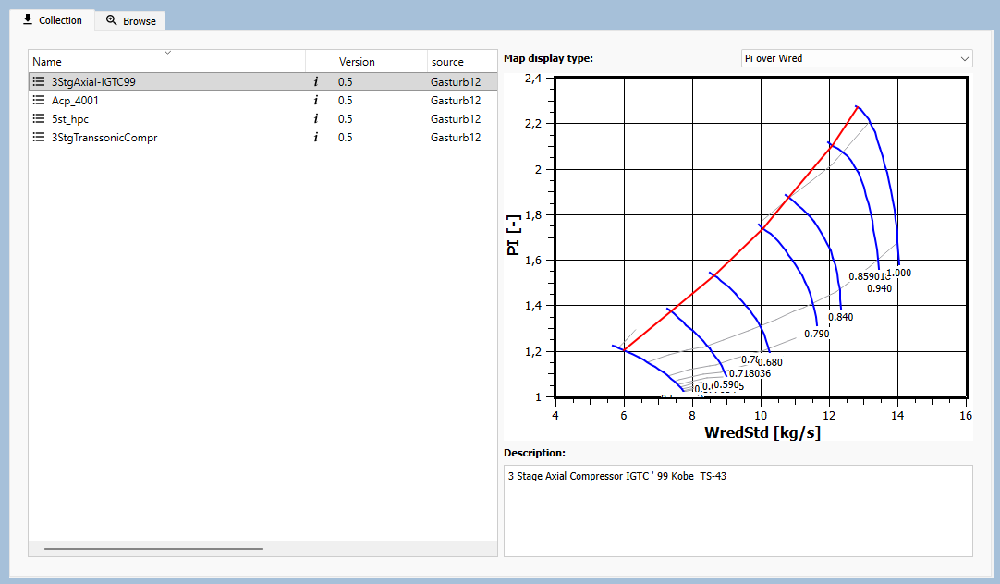
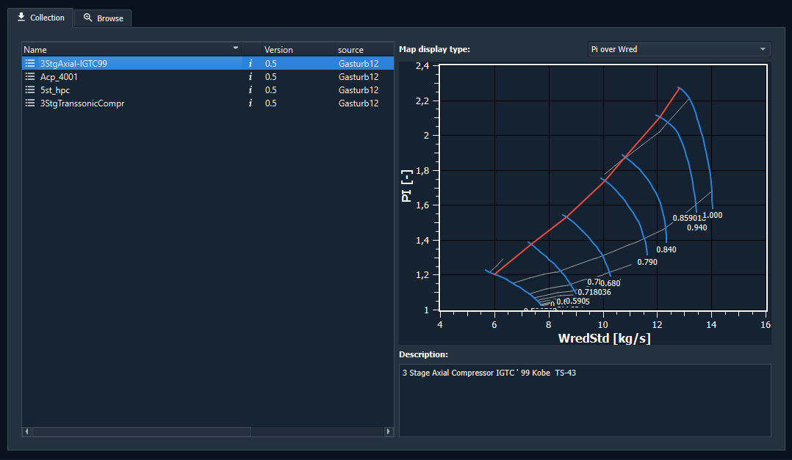

Shared Resources
================

GTlab can connect to simple web servers that publish reusable resources in a fixed folder layout.
This is the page to read if you want to make your own server available to GTlab users.

The resources are not project data. They are shared, domain-specific assets such as:

- engine maps
- scripts
- blade profiles
- other reusable reference data

If you only want to exchange projects between users, start with :doc:`Projects <../basics/04_projects>`.

What this page explains
-----------------------

This page focuses on the user-facing setup:

- what GTlab expects on the server
- how a server is discovered
- which files belong to one resource
- where GTlab stores downloaded copies locally

It does not describe module implementation details. Those belong to the module developer documentation.

How GTlab accesses shared resources
-----------------------------------

A module provides the user interface for accessing a specific type of shared resource.
The user configures the URL of the HTTP server from which the resources should be retrieved.

GTlab then accesses the resources as follows:

1. GTlab requests an ``index.dat`` file from the configured server URL.
2. The file lists the resources available on the server.
3. Each listed resource corresponds to a directory containing an ``index.json`` file with its metadata and the actual resource files.

This allows a web server to host a complete resource library, provided that it follows the required folder structure.

Map collections in practice
---------------------------

A common use case is a map collection server that publishes several engine maps.
In GTlab, the available resources appear in the collection browser on the left.
When you select one entry, GTlab shows its metadata and files on the right.

Server layout
-------------

A web server can host multiple resource collections. Each collection is
available under its own base URL. At the root of that URL, the server must
provide an ``index.dat`` file containing one entry per resource.

Each entry points to a resource directory. This directory must contain an
``index.json`` file describing the resource and listing the files that belong
to it.

The layout may look like this:

.. code-block:: text

   https://your-server.example/
   ├── maps/
   │   ├── index.dat
   │   ├── engine_map_001/
   │   │   ├── index.json
   │   │   ├── map.dat
   │   │   └── map_meta.xml
   │   └── engine_map_002/
   │       ├── index.json
   │       ├── map.dat
   │       └── map_meta.xml
   ├── blade_profiles/
   │   ├── index.dat
   │   └── blade_profile_a/
   │       ├── index.json
   │       └── profile.xml
   └── scripts/
       ├── index.dat
       └── script_pack_2026/
           ├── index.json
           ├── prepare_case.py
           └── helper_functions.py

For example, if ``https://your-server.example/maps/`` is configured as the
collection URL, its ``index.dat`` file looks like this:

.. code-block:: text
  
   engine_map_001
   engine_map_002

The paths in ``index.dat`` are read as server-relative entries.
This server contains 3 different collections (maps, profiles, scripts).

Required resource metadata
--------------------------

The resource descriptor in ``index.json`` must contain these fields:

.. list-table:: Required fields
   :header-rows: 1

   * - Field
     - Meaning
   * - ``ident``
     - Human-readable name shown in GTlab
   * - ``description``
     - Short description of the resource
   * - ``uuid``
     - Stable identifier used to match local and remote copies
   * - ``version``
     - Numeric version used to detect updates
   * - ``files``
     - List of files that belong to the resource

A minimal example looks like this:

.. code-block:: json

   {
     "ident": "Engine map for test rig A",
     "description": "Baseline map for the 2026 calibration setup",
     "uuid": "f4a4f2b4-5f0b-4f2d-bf25-2f76dce9c5f4",
     "version": 1.0,
     "files": [
       "map.dat",
       "map_meta.xml"
     ]
   }

If a module defines additional resource properties, they are also read from ``index.json``.
Those extra fields come from the module's collection structure and are shown in GTlab where applicable.

How GTlab uses the data
-----------------------

When GTlab reads the server, it compares the remote resources with what is already installed locally:

- same ``uuid`` and same or lower ``version`` → installed
- same ``uuid`` and higher ``version`` → update available
- unknown ``uuid`` → available for installation

Downloaded resources are stored locally under the application collection cache.
The cache path follows this pattern:

.. code-block:: text

   <GTlab application directory>/Collections/<collection-id>/<resource-uuid>/

GTlab downloads every file listed in ``files`` and also stores the corresponding ``index.json`` locally.

Setting up access in GTlab
--------------------------

To connect a server, open the access settings in GTlab and add a host for the relevant collection.
The collection ID must match the resource family provided by the module.

In the current setup, the access entry is just the server location GTlab should query.
If your server is behind a reverse proxy or a custom path, make sure the configured host points to the directory that exposes ``index.dat`` at its root.

Recommended setup checklist
---------------------------

- Host the resources on a plain HTTP or HTTPS server.
- Put one ``index.dat`` file at the server root.
- List one resource folder per line in ``index.dat``.
- Put an ``index.json`` file into every resource folder.
- Make sure the file names in ``files`` really exist on the server.
- Keep ``uuid`` stable across updates.
- Increase ``version`` whenever you publish a newer resource.

Typical mistakes
----------------

- ``index.dat`` points to a folder, but the folder has no ``index.json``.
- ``index.json`` misses one of the required fields.
- A file listed in ``files`` is not actually present on the server.
- The same resource gets a new ``uuid`` after an update, so GTlab treats it as a new item instead of an update.
- The server path is configured incorrectly, so GTlab cannot reach ``index.dat`` at the expected location.

If you need module-specific details
-----------------------------------

The exact metadata fields and the way GTlab displays them are defined by the module that owns the collection.
If you need help for a specific resource family, ask the module maintainers for the matching collection structure.

Related pages
-------------

- :doc:`Projects <../basics/04_projects>`
- :doc:`Preferences <../basics/05_preferences>`
- :doc:`FAQ <../faq>`
