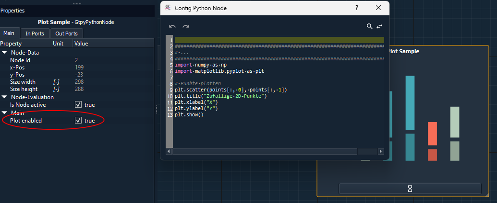

Frequently Asked Questions
==========================

This section provides answers to frequently asked questions about GTlab.  
Questions are grouped into categories for easier navigation.

General
-------

.. rst-class:: faq-question

Q: What is GTlab?
^^^^^^^^^^^^^^^^^
A: GTlab is ...

.. rst-class:: faq-question

Q: On which operating systems does GTlab run?
^^^^^^^^^^^^^^^^^^^^^^^^^^^^^^^^^^^^^^^^^^^^^

A: GTlab supports ...

Installation & Setup
--------------------

.. rst-class:: faq-question

Q: How do I install GTlab?
^^^^^^^^^^^^^^^^^^^^^^^^^^

A: Please refer to the :ref:`installation section <label_installation>` for detailed instructions.

.. rst-class:: faq-question

Q: Which Python versions are supported?
^^^^^^^^^^^^^^^^^^^^^^^^^^^^^^^^^^^^^^^
A: Currently, GTlab supports Python 3.9 ...

Workflows
---------

.. rst-class:: faq-question

Q: Why can't I find a workflow in my project, even though I know that my colleague has created it?
^^^^^^^^^^^^^^^^^^^^^^^^^^^^^^^^^^^^^^^^^^^^^^^^^^^^^^^^^^^^^^^^^^^^^^^^^^^^^^^^^^^^^^^^^^^^^^^^^^

A: The workflow has probably been sorted under the colleague's user name. 
In the drop-down menu at the top of the :ref:`Process/Calculator window<label_section_processdock>`, you can change the groupings and search for the workflow in the other groups.

**Q: What is a calculator?**  
A: A calculator is ...

**Q: Can I reuse workflows between projects?**  
A: Yes, workflows can be exported/imported using ...

Scripting
---------

.. rst-class:: faq-question

Q: How to import external Python scripts into the integrated environment?
^^^^^^^^^^^^^^^^^^^^^^^^^^^^^^^^^^^^^^^^^^^^^^^^^^^^^^^^^^^^^^^^^^^^^^

A: By default, only modules available in the current Python environment can be imported.  
To make additional scripts accessible, the directory containing them must be added to Python's search path. 
This can be done by importing the ``sys`` module and appending the desired path to ``sys.path``:

.. code-block:: python

   import sys
   sys.path.append("C:/path/to/your/scripts")

   import my_utils

Once the path has been added, scripts located in that directory can be imported and used as regular Python modules.

.. rst-class:: faq-question

Q: What is the difference between the the Python Script Calculator and the Python Task?
^^^^^^^^^^^^^^^^^^^^^^^^^^^^^^^^^^^^^^^^^^^^^^^^^^^^^^^^^^^^^^^^^^^^^^^^^^^^^^^^^^^^

A: The Python Script Calculator is a single calculator element that executes a user-defined Python script.
It is primarily used for prototyping new calculation methods or testing alternative approaches within a workflow.

The Python Task, on the other hand, is a workflow element that controls the execution of child tasks and calculators.
It allows building flexible and dynamic workflows by defining the workflow logic directly in Python, including loops,
conditions, and calculations, which can dynamically determine the order and repetition of its child elements.

.. rst-class:: faq-question

Q: Why can I not see my plot in the node?
^^^^^^^^^^^^^^^^^^^^^^^^^^^^^^^^^^^^^^

A: To display a plot in the node, there are a few things to consider:
 - The script in the Python node has an interface for matplotlib. Only plots created with it can be displayed. The scripts must end with the show() function of the plot object.
 - The node has a "Plot enabled" property. This must be set to true.
 - The plot can only be displayed if the node has a certain size. If in doubt, you can check this by dragging the node larger (in the bottom right-hand corner of the node).

.. rst-class:: faq-question

Q: How are python objects exchanged between the nodes?
^^^^^^^^^^^^^^^^^^^^^^^^^^^^^^^^^^^^^^^^^^^^^^^^^^^

A: Connections of the nodes' ports can be used for data exchange between the nodes. Only ports of the same type can be connected to each other.
The Python node can process all available types on the input side.
Many provided data types have a value() function or similar to make the data of the connection accessible in the Python script. This is also demonstrated in the attached examples.
A few generic data types are enabled on the output side. 
However, the intelli::ByteArrayData data type can be used to pass Python objects directly. 
In this case, the Python functionality "pickl" is used. This method is therefore restricted to data that [is pickl-capable.](https://docs.python.org/3/library/pickle.html#what-can-be-pickled-and-unpickled)

.. rst-class:: faq-question

Q: How to access the ports in the script?
^^^^^^^^^^^^^^^^^^^^^^^^^^^^^^^^^^^^^^

A: The data that is transmitted via the connections or ports can be called up in the script via their "Caption". This is set as a property in the corresponding window. 
This data object itself is not yet the value. This is usually obtained via a value() function or similar functions that can be implemented for the more specific data types.
Output parameters can also be used directly and also have the caption set in the property system as the name in the script.

Troubleshooting
---------------

.. rst-class:: faq-question

Q: My Module does not load
^^^^^^^^^^^^^^^^^^^^^^^^^^

A: You probably have unmet dependencies. If a module requires another module, GTlab will tell you in the output dock.
In many cases though, some shared libraries cannot be found that the module relies on.
To figure out, which libraries are required, use

* The ``ldd`` tool on Linux, e.g. ``ldd modules/my_modules.so``
* The *Dependencies* tool on Windows (https://github.com/lucasg/Dependencies)

Both tools help you to figure out, what the module needs and what is found and missing.

.. rst-class:: faq-question

Q: My Python environment is not detected, what should I check?
^^^^^^^^^^^^^^^^^^^^^^^^^^^^^^^^^^^^^^^^^^^^^^^^^^^^^^^^^^^^^^
A: Ensure that ...
