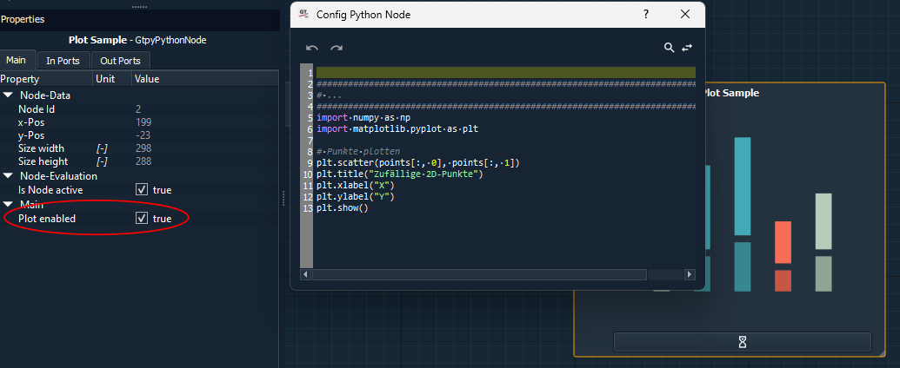

Frequently Asked Questions
==========================

This page collects short answers to the questions that usually come up first when people start using GTlab.

General
-------

.. rst-class:: faq-question

Q: What is GTlab?
^^^^^^^^^^^^^^^^^
A: GTlab is a modular framework for project-based engineering work. It combines project data, data models, workflows, and optional modules into one application.

.. rst-class:: faq-question

Q: On which operating systems does GTlab run?
^^^^^^^^^^^^^^^^^^^^^^^^^^^^^^^^^^^^^^^^^^^^^
A: The user installation is available for Windows and Linux. For the current installation details, see :ref:`installation section <label_installation>`.

Installation & Setup
--------------------

.. rst-class:: faq-question

Q: How do I install GTlab?
^^^^^^^^^^^^^^^^^^^^^^^^^^
A: Use the installer or the maintenance tool described in :ref:`installation section <label_installation>`.

.. rst-class:: faq-question

Q: Which Python versions are supported?
^^^^^^^^^^^^^^^^^^^^^^^^^^^^^^^^^^^^^^^
A: The bundled Python module currently targets Python 3.9. If you need another version, build the Python module from source and make sure the selected Python environment matches the installed module version.

Workflows
---------

.. rst-class:: faq-question

Q: Why can't I find a workflow in my project, even though I know that my colleague has created it?
^^^^^^^^^^^^^^^^^^^^^^^^^^^^^^^^^^^^^^^^^^^^^^^^^^^^^^^^^^^^^^^^^^^^^^^^^^^^^^^^^^^^^^^^^^^^^^^^^^
A: The workflow is probably grouped under the other user's name in the :ref:`Process/Calculator window <label_section_processdock>`. Change the group in the drop-down menu at the top of that dock and look for the workflow in the other groupings.

.. rst-class:: faq-question

Q: What is a calculator?
^^^^^^^^^^^^^^^^^^^^^^^^
A: A calculator is a workflow element that performs one concrete operation on project data, for example a calculation, transformation, or export step. Tasks coordinate calculators; calculators do the work.

.. rst-class:: faq-question

Q: Can I reuse workflows between projects?
^^^^^^^^^^^^^^^^^^^^^^^^^^^^^^^^^^^^^^^^^^^
A: Yes. You can export a task or calculator as ``.xml`` and import it into another workflow. If you only need a copy within the same workflow tree, use Clone or Copy from the context menu.

Scripting
---------

.. rst-class:: faq-question

Q: How do I import external Python scripts into the integrated environment?
^^^^^^^^^^^^^^^^^^^^^^^^^^^^^^^^^^^^^^^^^^^^^^^^^^^^^^^^^^^^^^^^^^^^^^^^^^^^^^
A: By default, only modules available in the current Python environment can be imported. To make additional scripts accessible, add the directory containing them to Python's search path. For example:

.. code-block:: python

   import sys
   sys.path.append("C:/path/to/your/scripts")

   import my_utils

Once the path has been added, scripts in that directory can be imported and used like regular Python modules.

.. rst-class:: faq-question

Q: What is the difference between the Python Script Calculator and the Python Task?
^^^^^^^^^^^^^^^^^^^^^^^^^^^^^^^^^^^^^^^^^^^^^^^^^^^^^^^^^^^^^^^^^^^^^^^^^^^^^^^^^^^^^
A: The Python Script Calculator is a single calculator element that executes a user-defined Python script. It is best for prototyping a calculation or transforming data at one specific step.

The Python Task is a higher-level workflow element that controls child tasks and calculators. It is used when the workflow logic itself should be defined in Python, including loops, conditions, and dynamic execution order.

.. rst-class:: faq-question

Q: Why can I not see my plot in the node?
^^^^^^^^^^^^^^^^^^^^^^^^^^^^^^^^^^^^^^^^^
A: Check three things:

 - The script must create the plot with the Matplotlib interface used by the Python node.
 - The node property ``Plot enabled`` must be set to true.
 - The node must be large enough to render the plot area.

.. rst-class:: faq-question

Q: How are Python objects exchanged between the nodes?
^^^^^^^^^^^^^^^^^^^^^^^^^^^^^^^^^^^^^^^^^^^^^^^^^^^^^^
A: Use the node ports for data exchange. Only compatible port types can be connected. On the input side, the Python node can handle the available GTlab data types. Many of them expose their value through a ``value()`` method or a similar accessor. For direct Python object transfer, use ``intelli::ByteArrayData`` and Python pickle-compatible objects.

.. rst-class:: faq-question

Q: How do I access the ports in the script?
^^^^^^^^^^^^^^^^^^^^^^^^^^^^^^^^^^^^^^^^^^^^
A: Use the port caption as the identifier in the script. The caption is defined in the port properties and is not itself the value. For most data types, call ``value()`` or the type-specific accessor to get the data. Output ports can usually be assigned directly.

Troubleshooting
---------------

.. rst-class:: faq-question

Q: My module does not load.
^^^^^^^^^^^^^^^^^^^^^^^^^^^
A: You probably have unmet dependencies. If a module requires another module, GTlab will tell you in the output dock. In many cases, a shared library cannot be found. To check which libraries are required, use:

* ``ldd`` on Linux, for example ``ldd modules/my_modules.so``
* the *Dependencies* tool on Windows: https://github.com/lucasg/Dependencies

.. rst-class:: faq-question

Q: My Python environment is not detected. What should I check?
^^^^^^^^^^^^^^^^^^^^^^^^^^^^^^^^^^^^^^^^^^^^^^^^^^^^^^^^^^^^^^
A: Check that the selected environment uses the same Python version as the installed GTlab Python module and that the path points to a valid conda, virtualenv, or embedded environment.
