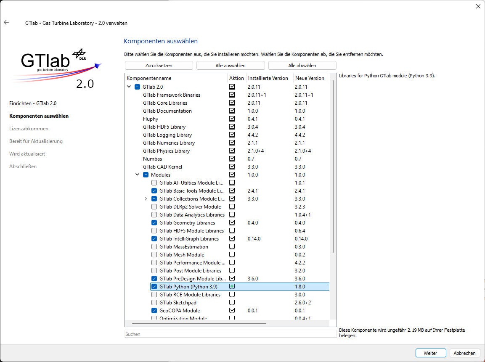
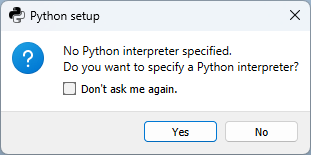
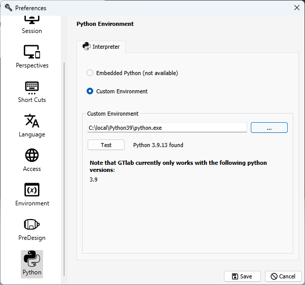
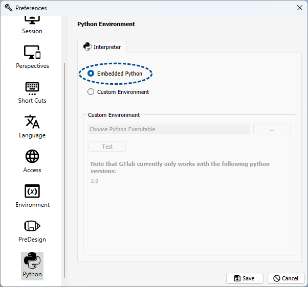

Initial Setup
=============

.. _label_section_python_install:

Enabling Python support in GTlab
--------------------------------

GTlab’s Python scripting is available through the **GTlab Python Module**, which can be installed either:

1. During the initial GTlab installation, or  
2. Later via the GTlab Maintenance Tool.

To install, select the component:

``GTlab 2.0 → Modules → GTlab Python (Python 3.X)``

where *X* refers to the supported Python version.

.. note::
   The installer currently provides a pre-compiled Python module for **Python 3.9 only**.  
   If you require GTlab with a different Python version, you must **compile the module from source**.  
   See the instructions at: https://github.com/dlr-gtlab/python-module?tab=readme-ov-file#compiling-from-source

.. _label_chapter_scripting2:

Setting up a Python Environment
-------------------------------

When launching GTlab for the first time after installation, you will be prompted to configure the Python environment.

This opens the Python Module settings page. To reopen it later, go to:

``Edit → Preferences → Python``

On this page, select the Python environment that GTlab will use.  
GTlab supports:

- System-wide Python installations  
- **conda** environments  
- **virtualenv** environments  

.. warning::
   The selected Python environment **must use the same version as the GTlab Python Module**.  
   By default, you must select a **Python 3.9** environment.

Recommended Packages
++++++++++++++++++++

For the best experience, we recommend installing the following packages in your chosen Python environment:

- ``numpy``  
- ``matplotlib``

Using an Embedded Python Environment
------------------------------------

Optionally, you can ship GTlab with a dedicated Python environment.  

To do this:

1. Prepare a standalone Python environment.  
2. Copy it into:  

   ``<gtlab_install_dir>/lib/python``  

When GTlab starts, it will automatically detect and use this **embedded environment**.  

To switch between the embedded and a custom environment, open the Python Module settings again and select the desired option.

