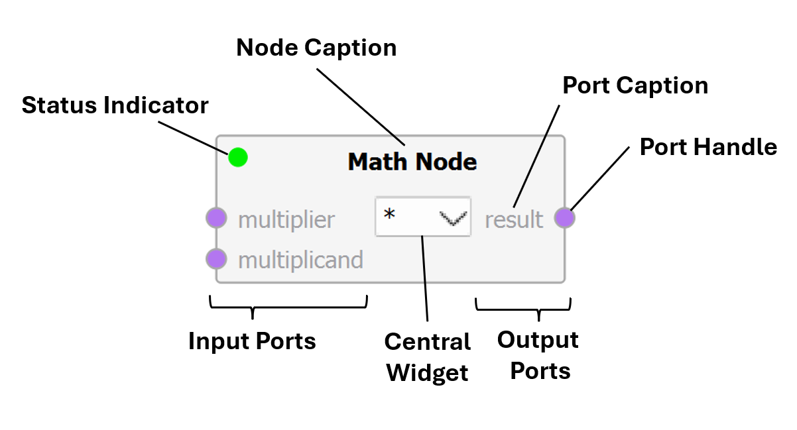
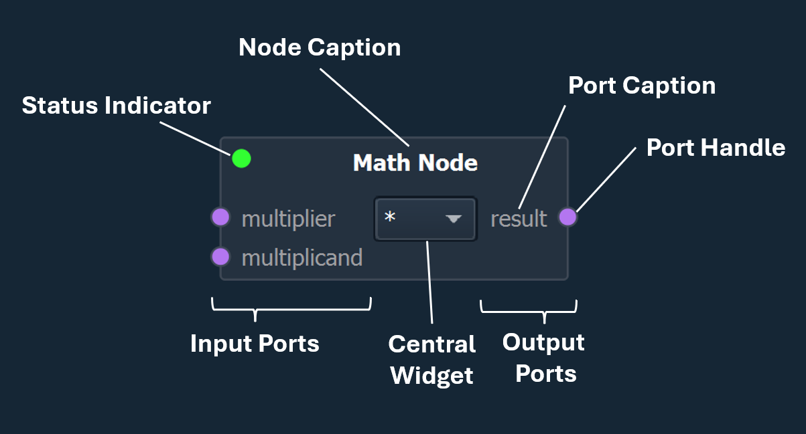
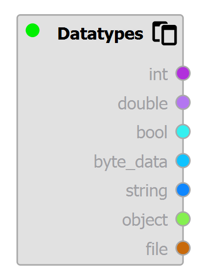
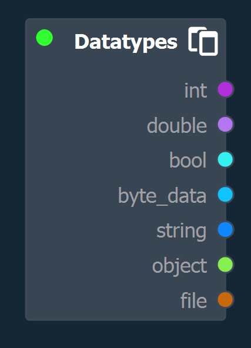
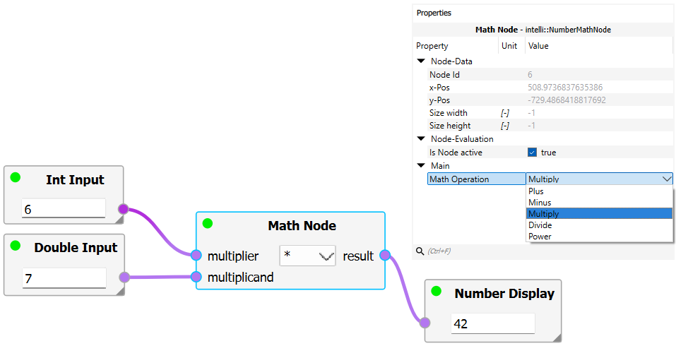
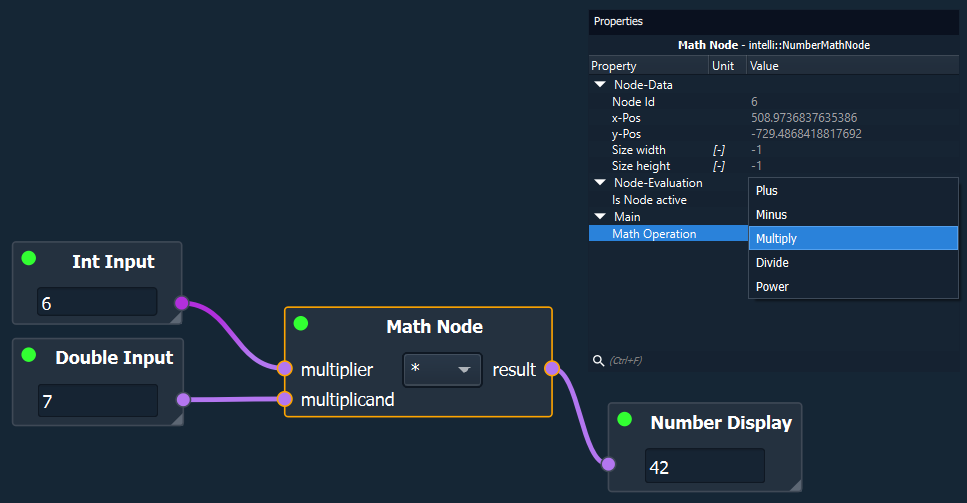

Graph-Based Workflows
=====================

The graph-based process architecutre operates on the **functional programming** paradigm:

Instead of modifying a central state, small functional blocks -- here called `nodes` -- operate on a set of inputs and yield a set of outputs. 
Nodes are interconnected using `connections`, where the outputs of a node are connected to inputs of other nodes.

The resulting datastructure is a so-called **directed acyclic graph**: 

- `Directed` meaning, that data "flows" is one direction only. Here data can only flow forward, i.e. the data at the outputs of a node feed into the inputs of the sucessor nodes.

- `Acyclic` denotes, that a graph cannot contain loops or cycles. As such, in an acyclic graph the predecessors of a node (both indirect and direct predecessors) cannot simultaneously be successor nodes as well.

.. image:: images/workflows_graph_architecture_bright.png
   :align: center
   :alt: Directed Acyclic Graph
   :class: only-light
   
.. image:: images/workflows_graph_architecture_dark.png
   :align: center
   :alt: Directed Acyclic Graph
   :class: only-dark

Intelli Graphs
--------------

In GTlab, the graph-based process architecutre is called **Intelli Graphs**.
Like many features and functionalities of GTlab, this architecutre too is implemented by a module -- the **IntelliGraph-Module**.
To use Intelli Graphs, this module must be installed and activated for the current project (see :ref:`Creating Graphs → Initial Setup <label_section_intelli_graph_install>`).

Nodes
"""""

Nodes represent a function or operation in a graph. 

Each node may have multiple input and output **ports**.
Some nodes only have outputs ports and thus act as an input to the graph, wheras other nodes only have input ports and thus act as an output of the graph.

   

	
Each port is associated with a **datatype**. 
Only ports with compatible datatypes can be connected.
Some ports have a caption or a tooltip, the latter can be triggered by hovering over the port.

Each datatype is associated with a color to better distinguish each type. 
Connections are colorized according to this datatype.

Some datatypes -- while different -- are compatible with each other and are converted implictly by the Intelli Graph system.
When creating a connection, only valid target nodes and their ports are highlighted. 
Connections between different but compatible datatypes are indicated by gradient.

   

   
Some nodes may embed a **central widget**, which may either be used for the user to input values, to configure the node, to display results, or similar.
Besides the central widget, many nodes use the :ref:`Property System<label_section_properties>` for configuring additional settings.
Clicking on a node triggers the :ref:`Property Dock<label_property_dock>` to show the available properties of the node.
    

   

Data Flow
"""""""""

For a node to evaluate (= perform its operation) the nodes connected to the input ports (= predecessors) must be evaulated first.
Once a node is evaluated, the data is forwarded via the output ports to the connected successor nodes.

Following this principle, a chain of dependencies forms.
Intelli Graphs use this dependency-chain to evaulate each node in the correct order.
Hence, when evaluating a graph the nodes with no inputs are evaluated first.
Only then, the nodes "downstream" are evaluated as they become ready.

It should be noted that for most nodes not all input ports have to be connected.
Further, a node is still evaluated even if none of the output ports are connected.

Nodes, that are not dependent on each other are evaluated in parallel by the Intelli Graph system.

See :ref:`Graph Execution <label_section_graph_execution>` for more details.

Further Reading
"""""""""""""""

.. toctree::
   :maxdepth: 1

   graph-based/01_creating_graphs
   graph-based/02_execution
   graph-based/03_standard_nodes