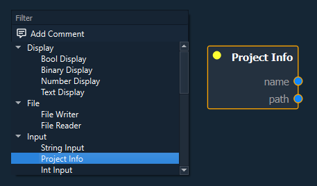

.. _label_section_creating_graphs:

Creating Graphs
---------------

.. _label_section_intelli_graph_install:

Initial Setup
"""""""""""""

The **IntelliGraph-Module** must be installed and activated for the active project.

To install, select the component in the Maintenance Tool:

	*GTlab 2.0* → *Modules* → *GTlab IntelliGraph Libraries*
	
To activate the module for the current project, right click on the project in the Explorer Dock and navigate to:

	*Choose Project Modules* → *IntelliGraph*

Creating a Graph
""""""""""""""""

Once the module is activated for the current project, a new datatree object named ``IntelliGraphs`` appears. 
This object is the also called **package**.
All Intelli Graphs are organized in this package.

First, one has to create a **category object**, which can be used to organize Intelli Graphs accordingly.
To add a new category, right-click the package and select *Add Category*.
Enter the name of the category and confirm.

.. note::
   Category objects on the same level cannot be named the same. The object names should update automatically to create unqiue names.
   
To create a **new graph**, right-click the desired category and select *Add Graph*.
Enter the name of the graph and confirm.

.. note::
   Graph objects on the same level cannot be named the same. The object names should update automatically to create unqiue names.
   
Double click the newly created graph object or right-click and select *Open*.
The so-called **Graph View** will open and display the selected graph in the central widget area.
For a newly created graph the displayed **Graph Scene** is empty.

In the top-left corner of the Graph View a small menu bar is displayed.
Here, view and scene specific actions can be performed, such as

- Enabling/disabling the grid
- Centering the view
- Resetting the scale
- Toggling automatic evaluation of the graph
- Enabling/disabling snap to grid

   

Adding Nodes and Connections
^^^^^^^^^^^^^^^^^^^^^^^^^^^^

To add new nodes right-click on an empty space in the scene, displaying the *Scene Menu*.
The Scene Menu lists all available nodes, organized into categories/types of nodes.
Clicking an entry will create a new instance of the selected node.

To add information into the graph, input nodes are used.
These allow entering values, referencing directories and files, or accessing data objects of the project.

For example, the *Project Info* node allows to access the name and directory of the project.

   

We can use this node in combination with a *File Input* and *String Input* node to open a file relative to the current project directory. In this example, a file was explicity added to the project directory named *readme.txt*. 

To connect nodes, left-click the desired port handle, and drag and drop the connection on a target port of another node.
Compatible/valid target ports are highlighted automatically and the cursor snaps to the nearest port to highlight, which port will be connected.

After connecting the String Input and Project Info nodes to the File Input node accordingly, a file handle is created that can be used for further processing by other nodes.

In particular, a *File Reader* node exists that attempts to read the file and outputs the content of said file.
If the file does not exist the File Reader will "fail" (denoted by the status indicator, see :ref:`Graph Execution → Evaluation States of Nodes <label_section_graph_execution_states>`).
To display the content, the *Text Display* node may be used -- thus completing this example.

   

Comments
^^^^^^^^

Besides nodes, comments can be added to a graph via the Scene Menu's entry *Add Comment*.

Comments support markdown syntax and can be resized freely. 
They are intended to be used as way to document a graph for yourself or other people.

Double-click the comment to edit. 

Comments can either be standalone ("floating") in a scene or they can be connected to one or multiple nodes.
To associate a comment to antoher node, right-click the comment and select *Connect to...*. 
Click on the desired node.
A dotted line indicates that the connection succeeded.

   

   
Further, comments can be collapsed to take up less space.
To collapse a comment, right-click the node and select *Collapse selected objects*.
If a comment is linked to a single node, it will dock onto the node until its uncollapsed.

Subgraphs
"""""""""

Multiple nodes can be grouped into a so-called *subgraph*, allowing the user to organize a graph and reduce its visual complexity.

To group nodes, right-click on a selection of nodes and select *Group selected Nodes* in the context menu.
Enter a name for the subgraph and confirm.

   

   
The selection will be replaced by a single node, the subgraph node.
This node is slightly tinted and contains an icon in the top-right corner of the node indicating it as a subgraph node.

   

   
The subgraph can be opened by double-clicking the node or right-clicking and selecting *Open*.
The subgraph is opened in the same Graph viewer but in a different Graph Scene on a nested level.

   

After grouping the selection of nodes and opening the subgraph, one can find that the selected nodes have been moved to this level and connected as expected.
Each subgraph has two special types of nodes, an input and output provider node.
Using the context menu of these nodes new inputs and outputs to the graph can be added.
   
To navigate to the parent scene, find the *Scene Hierarchy* in the menu bar in the top-left of the Graph View.
This widget displayes the current level and allows the user to navigate to any intermediate level by click the desired (sub)graph name.
   
A subgraph can also be expanded/resolved.
Right-click the subgraph and select *Expand Subgraph*. 
