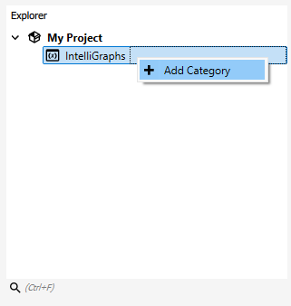
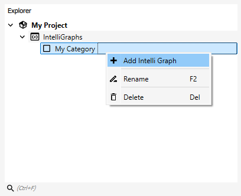
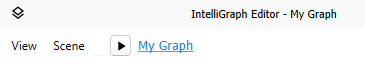
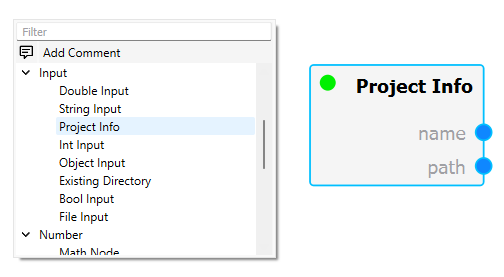

Creating Graphs
---------------

Requirements
""""""""""""

The `IntelliGraph`-Module must be installed and activated for the active project.

To install, select the component in the Maintenance Tool:

	*GTlab 2.0* → *Modules* → *GTlab IntelliGraph Libraries*
	
To activate the module for the current project, right click on the project in the Explorer Dock and navigate to:

	*Choose Project Modules* → *IntelliGraph*

Creating a Graph
""""""""""""""""

Once the module is activated for the current project, a new datatree object named ``IntelliGraphs`` appears. 
This object is the also called package.
All Intelli Graphs are organized in this package.

First, one has to create a category object, which can be used to organize Intelli Graphs accordingly.
To add a new category, right-click the package and select *Add Category*.
Enter the name of the category and confirm.

.. note::
   Graph objects on the same level cannot be named the same. The object names should update automatically to create unqiue names.
   
To create a new graph, right-click the desired category and select *Add Graph*.
Enter the name of the graph and confirm.

.. note::
   Graph objects on the same level cannot be named the same. The object names should update automatically to create unqiue names.
   
Double click the newly created graph object or right-click and select *Open*.
The so-called *Graph View* will open and display the selected graph in the central widget area.
For a newly created graph the displayed *Graph Scene* is empty.

In the top-left corner of the Graph View a small menu bar is displayed.
Here, view and scene specific actions can be performed, such as

- Enabling/disabling the grid
- Centering the view
- Resetting the scale
- Toggling automatic evaluation of the graph
- Enabling/disabling snap to grid

Adding Nodes and Connections
^^^^^^^^^^^^^^^^^^^^^^^^^^^^

To add new nodes right-click on an empty space in the scene, displaying the *Scene Menu*.
The Scene Menu lists all available nodes, organized into categories/types of nodes.
Clicking an entry will create a new instance of the selected node.

To add information into the graph, input nodes are used.
These allow entering values, referencing directories and files, or accessing data objects of the project.

For example, the *Project Info* node allows to access the name and directory of the project.

We can use this node in combination with a *File Input* and *String Input* node to open a file relative to the current project.

.. image:: ../images/workflows_graph_how_to_add_nodes_2.png
   :align: center
   :alt: Adding a String Input and File Input node
   
In this example, a file was explicity added to the project directory named *readme.txt*. 
After connecting the String Input and Project Info nodes to the File Input node, a file handle is created that can be used for further processing.

.. image:: ../images/workflows_graph_how_to_add_nodes_3.png
   :align: center
   :alt: Connecting all nodes accordingly

In particular, a *File Reader* node exists that attempts to read the file and outputs the content of said file.
To display the content, the *Text Display* node may be used -- thus completing this example.

.. image:: ../images/workflows_graph_how_to_add_nodes_4.png
   :align: center
   :alt: Adding a File Reader and Text Display node, finalizing the example

Organizing graphs
"""""""""""""""""

Subgraphs
^^^^^^^^^

Grouping Nodes into Subgraphs
=============================

Navigating Graph Hierarchy
==========================

Input and Output Providers
==========================

Expanding Subgraphs
===================

Comments
^^^^^^^^
