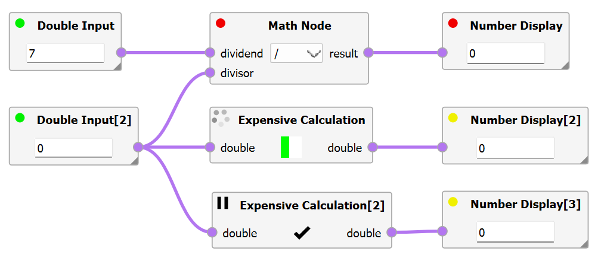
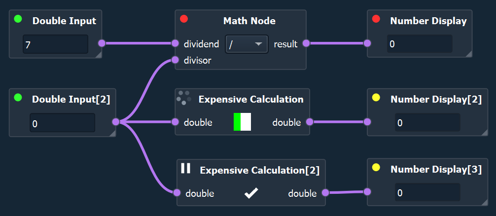

.. _label_section_graph_execution:

Graph Execution
---------------

Intelli Graphs can be executed in two ways: Automatically or manually.
Further, nodes can be triggered individually or deactivated temporarily.

Manual Execution of Nodes
^^^^^^^^^^^^^^^^^^^^^^^^^

Nodes can always be started manually via their context menu.
Right-clicking on a node and select *Execute once* to trigger its execution, regardless of whether it has been evaluated or not.

All nodes upstream (i.e. that are required to execute this node) are also evaluated once, if they have not been evaluated yet. 
No subsequent nodes are executed, however they are marked as "Outdated" (see :ref:`Evaluation States of Nodes <label_section_graph_execution_states>`)

.. image:: ../images/workflows_graph_exec_1_bright.png
   :align: center
   :alt: Application settings in preferences
   :class: only-light

.. image:: ../images/workflows_graph_exec_1_dark.png
   :align: center
   :alt: Application settings in preferences
   :class: only-dark

Automatic Execution of Nodes
^^^^^^^^^^^^^^^^^^^^^^^^^^^^

It is also possible to set the graph to automatically keep all nodes evaluated.

If **automatic evaluation** is enabled, nodes that are outdated will be triggered automatically by the Intelli Graph system. 
In practice, this means that if the initial value of a node changes (e.g. the input of node, their configuration, etc.), all subsequent nodes are also re-evaluated automatically.
In general, Intelli Graphs attempts to evaluate each node just once per iteration (if required).

To enable automatic evaluation use the "play"-button in the menu bar of the Graph View (top-left corner of the editor). 
To disable automatic evaluation use the "stop"-button instead, setting the graph to manual execution only.

Enabling automatic evaluation for the first time evaluates the entire graph once.  

.. image:: ../images/workflows_graph_exec_2_bright.png
   :align: center
   :alt: Automatic Execution
   :class: only-light

.. image:: ../images/workflows_graph_exec_2_dark.png
   :align: center
   :alt: Automatic Execution
   :class: only-dark

Pausing Nodes
"""""""""""""

Individual nodes can be paused/deactivated.
This flag is only relevant if automated execution is enabled.
A paused node will not be evaluated automatically, including all connected successors nodes.
This setting can be handy, if a node is computationally expensive and should only be triggered e.g. once the graph has been set up correctly.

However, it should be noted, that a paused node by be evaluated if it or another node downstream is triggered manually.

Pausing can be switched on and off via the context menu of the node.
Right-click on the node and select *Set Inactive* or *Set Active*.
Alternatively, a node can be (un)paused using the Property Dock by changing the entry *Is Node active*.

.. _label_section_graph_execution_states:

Evaluation States of Nodes
^^^^^^^^^^^^^^^^^^^^^^^^^^

The state of each node is indicated by a coloured dot in the top-left corner of the node.

A distinction is made between mutliple states.

+------------------+---------------+----------------------------------------------------------------------------------------------------------+
| Category         | Color/Symbol  | Description                                                                                              |
+==================+===============+==========================================================================================================+
| Invalid/Error    | red dot       | The node is misconfigured or an error occurred during the evaluation of the node.                        |
+------------------+---------------+----------------------------------------------------------------------------------------------------------+
| Outdated         | yellow dot    | This node has not yet been evaluated with the currently available data and is thus outdated.             |
+------------------+---------------+----------------------------------------------------------------------------------------------------------+
| Valid/Evaluated  | green dot     | The node was evaluated successfully with the currently available data and is thus up-to-date.            |
+------------------+---------------+----------------------------------------------------------------------------------------------------------+
| Evaluating       | spinning dots | The node is currently evaluating.                                                                        |
+------------------+---------------+----------------------------------------------------------------------------------------------------------+
| Paused           | pause icon    | The node will not be evaluated automatically and can only be triggered manually directly or indirectly.  |
+------------------+---------------+----------------------------------------------------------------------------------------------------------+

