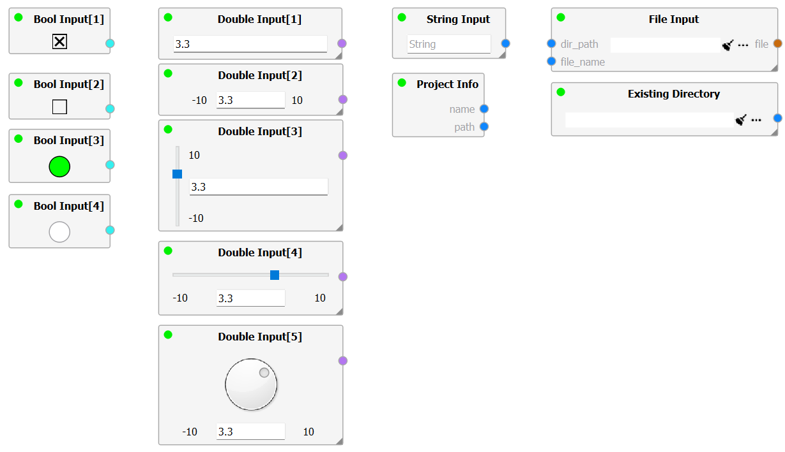
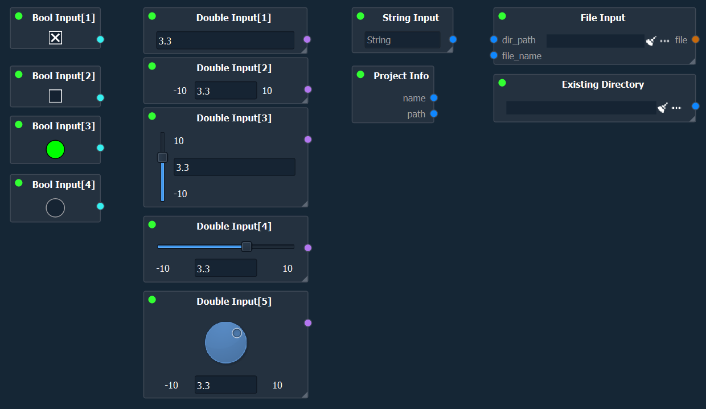
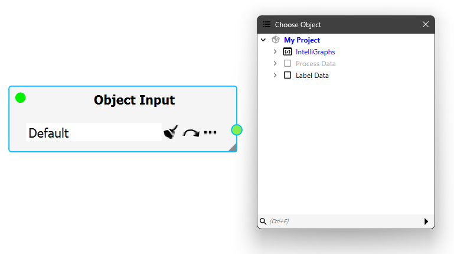
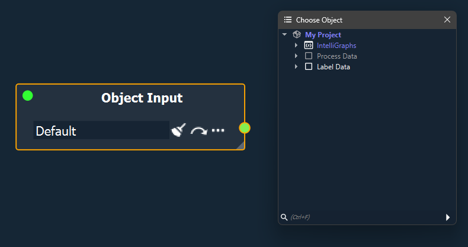
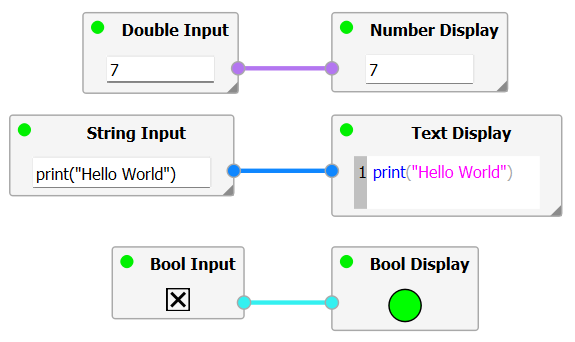
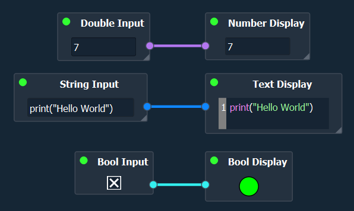

Standard Nodes
--------------

Each module may define their own nodes.

This page gives an overview over the nodes defined by the core modules.

IntelliGraph-Module
~~~~~~~~~~~~~~~~~~~

The following nodes are defined by the `IntelliGraph`-Module.

Input Nodes
"""""""""""

Various nodes are implemented to input values of various types into the graph.

For plain data, a *Double Input*, *Int Input*, *Boolean Input*, and *String Input* Node exists.

Further -- as highlighted in :ref:`Creating Graphs <label_section_creating_graphs>` -- a *Project Info* and *File Input* Node exist.

Each of these nodes contain a central widget, with which the user can enter a value, string, reference a file, or directory.
For the number and bool input nodes, multiple input widget-modes exists.
These can be changed using the corresponding entry in the :ref:`Property Dock<label_property_dock>` of the input node.

By far, one of the most useful input nodes is the **Object Input** node.
As the name implies, the Object Input node allows the user to reference an object in the project data tree.

To select an object, either drag and drop the desired object onto the widget or left-click on the "three dots"-icon (similar to the object-link property).
One can jump to the referenced object by clicking the "arrow"-icon or clear the referenced object, by left-clicking the "clear"-icon.

.. note:: Each node connected to the Object Input node will operate on a copy of the referenced object. Thus, the original object cannot be overwritten accidentally.

   
Display Nodes
"""""""""""""

To display intermediate results, multiple nodes are implemented.

A *Number Display*, *Bool Display*, and *Text Display* node exists.

The Text Display node supports various syntaxt highlighting, allowing to render XML, JSON, or Python code accordingly (Highlighting can be set using the :ref:`Property Dock<label_property_dock>` of the Text Display node).

   
Output Nodes
""""""""""""

Currently, the InteliGraph-Module only implements a single output node, the **Object Sink** Node.

This node allows the user to append/override an object to the datatree.
The node contains a central widget, with which the object must be comitted to the datamodel explicitly.

To set the target object in the project's datatree, use the :ref:`Property Dock<label_property_dock>` of the sink node.

Data Mutating Nodes
"""""""""""""""""""

Various nodes exist that allow the user to mutate data, be it strings, perform calculations, or conversions.

Examples include the *String Builder* node and the File Operations Nodes (Read & Write).

.. note:: Use the File Writer node with care, as files may be created or overwritten accidentally when evaluating with inproper inputs.

Hub-Spoke specific Nodes
""""""""""""""""""""""""

Further, certain :ref:`Calculators <label_section_calculators>` can be executed within an Intelli Graph using the **Execute Calculator** Node.

However, not all calculators are designed to support this feature.