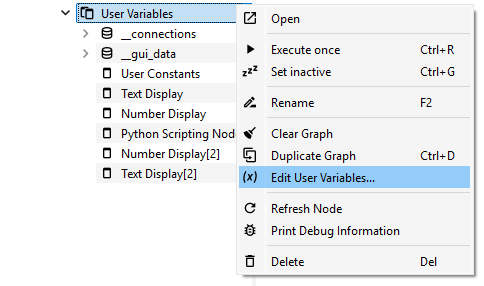
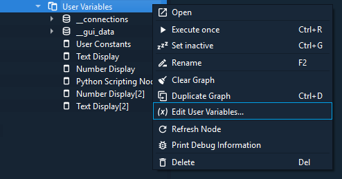
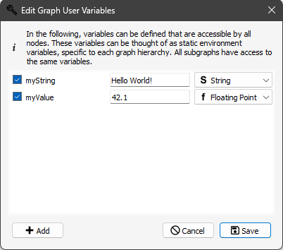
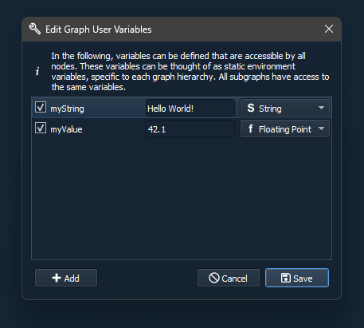
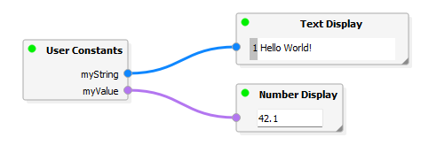
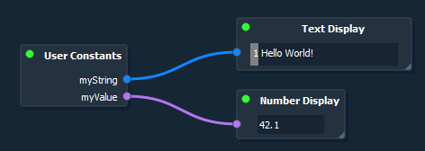
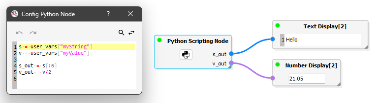
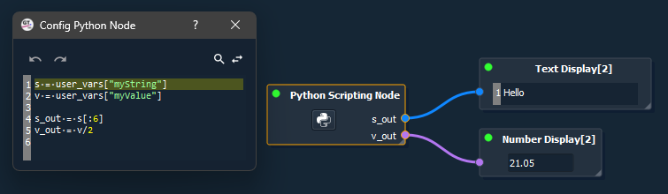

User Variables
--------------

For some workflows user-defined global variables may be required.
The IntelliGraph-Module allows to define such variables in the form of key-value pairs, called **user variables**.

User variables are defined per Graph and are persistently in the project.
All Nodes, including nodes in subgraphs, have access to the same user variables of the root graph.

Editing User Variables
""""""""""""""""""""""

To edit the user variables of a graph, right-click the object of the root graph in the Explorer and select *Edit User Variables*.
   

   

   
A dialog is opened, in which user variables may be added or edited.
For each variable a unique key must be defined.
Under this key the user variable may be accessed by other nodes.

For the value of variable, a type must be specified as well as its value.
These types include:

- Boolean (true, false)
- Integer
- Floating point values
- Strings

Unchecking a user variable and saving will cause the user variable to be deleted.

   

Using User Variables
""""""""""""""""""""

User variables are usually accessed in two ways: using the dedicated node that exposing the user variables and or using a scripting node.

User Constants Node
^^^^^^^^^^^^^^^^^^^

Right-click the scene and add a **User Constants** node (see :ref:`Creating Graphs → Adding Nodes and Connections <label_section_intelli_graph_add_nodes>` on how to add nodes).

The user variables are automatically exposed as output-ports of the nodes.
Editing the user variables causes the node to automatically update.

   

   
Python Scripting Node
^^^^^^^^^^^^^^^^^^^^^
  
The user variables can be accessed in a **Python Node** (see :ref:`Scripting of GTlab → Nodes <label_scripting_nodes>`) using the `user_vars` dictionary like a normal python key-value dictionary.
  

   

