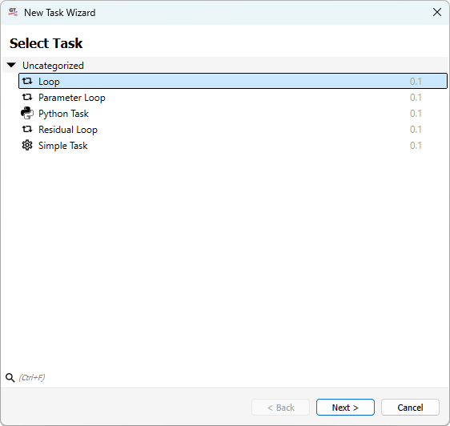
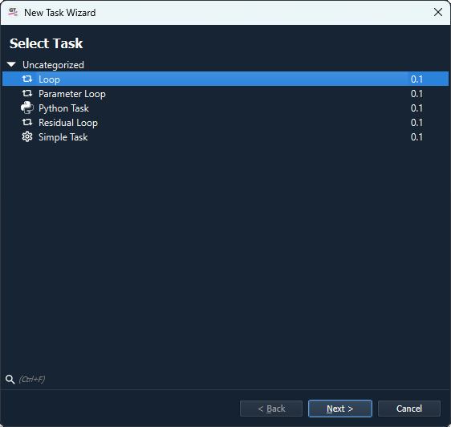

.. _label_section_how_to_buid_process:

Creating a workflow
-------------------

The main window for setting up workflows in the Task/Calculator structure is the :ref:`associated dock widget <label_section_processdock>`.

Workflows that have already been created are displayed here, individual elements can be selected for editing and the workflows can also be started.

Add a new task
^^^^^^^^^^^^^^

The *+ Add...* button can be used to add new elements for a new workflow or an existing workflow.
If no workflow is selected, only the task elements can be selected as the starting point for a new workflow.

   

The option *Empty Root Task* is suggested first in the menu. This enables a new workflow to be started directly with a basic task element,
which has no further coordinating function except to execute all subordinate workflow elements once.
In addition, the context menu shows a series of the most recently prioritised workflow elements for quicker selection.

The *New Task...* button opens an editor that displays all available tasks from which you can choose.

   

In this *New Task Wizard*, the available tasks are sorted into categories. If additional tasks are added via modules, they can also be found here.
If a task is now selected, the *Next* button can be pressed and the task's propeties can be customised. However, this can also be done later.
The wizard is ended with *Finish* and the task appears in the overview in the window.

Add a new calculator
^^^^^^^^^^^^^^^^^^^^

Just like creating a new task, you can also add a calculator to a task. Calculators themselves cannot be the highest element of a workflow.
If you simply want to execute a calculator, you assign it to a base task.
Further tasks can also be arranged under tasks, e.g. to execute loops in sub-processes or similar.

If a task is selected and then *+ Add* is pressed, more items now appear in the menu that appears, in particular *New Calculator...*.
This in turn takes you to an overview of the available calculators. If an element is selected and *Next* is pressed, properties can be
can be set and the workflow is ended via *Finish* and the calculator is placed under the task.

Start a workflow
^^^^^^^^^^^^^^^^

The selected task is started via the *Run* button, the name of which is supplemented by the selected task.

The same button can also be used to cancel tasks prematurely or to add further tasks to the :ref:`queue <label_section_process_queue>` for subsequent execution.

   

