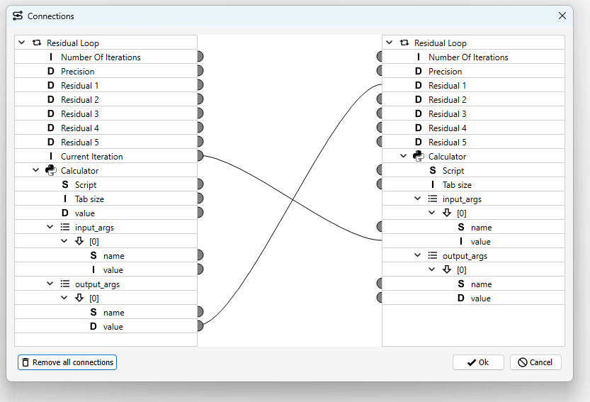
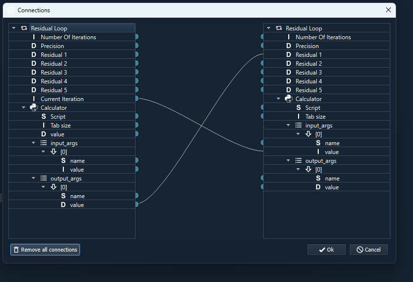

.. _label_chapter_workflow_elements:

Workflow Elements
=================

The central building blocks of the workflows are Calculators_ and Tasks_.

Calculators represent individual workflow steps, while tasks are intended for workflow coordination,
A simple example of this is a loop task, which coordinates the repeated execution of individual processes.
Like the data model, the workflows are generally arranged hierarchically.
This means that the process elements (calculators) are arranged below the coordinating task.

Calculators and tasks are provided in particular by modules.
For this reason, only a few elements are available in GTlab without or with only the basic modules.

Context menu
------------
Both calculators and tasks have a context menu that can be opened by right-clicking on the element.

It is explained for all entries whether they are valid for both types or only for one.

*Run Task* (tasks only)
  Starts the selected task

*Config*
  Opens the configuration wizard of the workflow element. 
  This can be an overview of the properties, but also a comprehensive user interface for complex elements

*Connection Editor*
  Opens the :ref:`connection editor <label_section_connection_editor>`.
  
*Add* (tasks only)
  Menu to add a subelement to the current task.  
  
*Skip*
  Sets the current element to *skip*. The element will not be executed and skipped in a workflow execution.

*Import* (tasks only)
  Import of a .xml-file of a workflow to be added as a sub-workflow. 

*Export* 
  Export of an element (and its child elements) to a .xml-file. This later can be imported to an existing task.

*Rename*
  Enables to rename the currently seleceted element
  
*Clone*   
  Generates a copy of the currently selected process element.	

*Cut*
  Copy the currently seleceted element to clipboard and remove it.

*Copy*
  Copy the currently selected element to clipboard.

*Delete*
  Removes the currenlty selected element.

.. _label_section_calculators:

Calculators
-----------

Export Object to Memento
^^^^^^^^^^^^^^^^^^^^^^^^
This calculator can be used to export a data model object in text form (.xml format). 
In addition to the object, you must also specify where the file is to be saved on the computer.

:ref:`Python Script Calculator <label_scripting_calculators>`
^^^^^^^^^^^^^^^^^^^^^^^^^^^^^^^^^^^^^^^^^^^^^^^^^^^^^^^^^^^^^^^^^
This calculator is described in more detail in the section on python integration in GTlab.

.. _label_section_tasks:

Tasks
-----

Loop
^^^^
This task coordinates the repeated execution of all subordinate elements. 
A number of executions defined as *Number of Iterations* is used. 
The current number of executions is specified via the property *Current Iteration*.

Parameter Loop
^^^^^^^^^^^^^^
This task is also used for a loop. However, here a value range is specified directly for a parameter of interest with *start*, *end* and *steps*. 
This means that starting from the start value, the specified steps are used to reach the end value. 
For example, a start value of 5, target value of 9 and 2 steps results in three versions with the values 5, 7 and 9.
These values are specified via the *currentVal* parameter. 
This value can be passed on to child elements via the :ref:`connection editor <label_section_connection_editor>`.  

:ref:`Python Task <label_scripting_tasks>`
^^^^^^^^^^^^^^^^^^^^^^^^^^^^^^^^^^^^^^^^^^^^^^
This task is described in more detail in the section on python integration in GTlab.

Residual Loop
^^^^^^^^^^^^^
This task is intended to coordinate iterations in which one or more target values are to fall below a specified accuracy value.

The *Number Of Iterations* specifies the maximum number of iterations to be used.
The *Precision* specifies the tolerance that should be undercut.
In addition, up to five residuals are possible, which are analysed to determine whether they all fall below the tolerance. 
Only the activated properties are taken into account.

This task can only be used sensibly if it and its child elements are linked using connection editor. 
The residual values here must be determined by sub-elements and then passed to the task via connection.

In the example shown, the number of the current iteration is passed on to a calculator.
This processes this and outputs a value for the residual and passes it on to the task via a connection.

Simple Task
^^^^^^^^^^^
This is the basic task element. The task is executed once with all subordinate elements.

