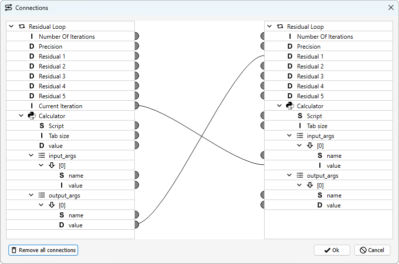

.. _label_chapter_workflow_elements:

Workflow Elements
=================

The central building blocks of GTlab workflows are **Calculators** and **Tasks**.

- **Calculators** represent individual workflow steps, such as the execution of a single tool or a data transformation.  
- **Tasks** are higher-level elements responsible for workflow coordination.  
  A common example is a *Loop Task*, which manages the repeated execution of one or more calculators.  

Workflows are generally arranged **hierarchically**, similar to the data model.  
In this hierarchy, calculators operate under the coordination of tasks.

Both calculators and tasks are primarily provided by GTlab modules.  
Therefore, only a limited set of elements is available in a bare GTlab installation without additional modules.

Context menu
------------
Both calculators and tasks have a context menu that can be opened by right-clicking on the element.

It is explained for all entries whether they are valid for both types or only for one.

.. list-table::
   :header-rows: 1
   :widths: 25 75

   * - Action
     - Description
   * - **Run Task** *(tasks only)*
     - Starts the selected task.
   * - **Config**
     - Opens the configuration wizard of the workflow element.  
       Depending on the element, this may be a simple property overview or a comprehensive user interface.
   * - **Connection Editor**
     - Opens the :ref:`connection editor <label_section_connection_editor>`.
   * - **Add** *(tasks only)*
     - Adds a subelement to the current task.
   * - **Skip**
     - Marks the current element to be skipped during workflow execution.
   * - **Import** *(tasks only)*
     - Imports a ``.xml`` file as a sub-workflow into the current task.
   * - **Export**
     - Exports an element (and its child elements) to a ``.xml`` file, which can later be imported into another task.
   * - **Rename**
     - Renames the currently selected element.
   * - **Clone**
     - Creates a copy of the currently selected element.
   * - **Cut**
     - Copies the selected element to the clipboard and removes it.
   * - **Copy**
     - Copies the selected element to the clipboard.
   * - **Delete**
     - Removes the currently selected element.

.. _label_section_calculators:

Default Calculators
-------------------

Without any additional modules installed, the GTlab core framework already provides a set of **default calculators**.  
These serve as the foundation for building workflows and can be used directly out of the box:

Export Object to Memento
^^^^^^^^^^^^^^^^^^^^^^^^
This calculator can be used to export a data model object in text form (.xml format). 
In addition to the object, you must also specify where the file is to be saved on the computer.

:ref:`Python Script Calculator <label_scripting_calculators>`
^^^^^^^^^^^^^^^^^^^^^^^^^^^^^^^^^^^^^^^^^^^^^^^^^^^^^^^^^^^^^^^^^
This calculator is described in more detail in the section on python integration in GTlab.

.. _label_section_tasks:

Default Tasks
-------------

The following tasks are provided with the core installation of GTlab.

Loop
^^^^
This task coordinates the repeated execution of all subordinate elements. 
A number of executions defined as *Number of Iterations* is used. 
The current number of executions is specified via the property *Current Iteration*.

Parameter Loop
^^^^^^^^^^^^^^
This task is also used for a loop. However, here a value range is specified directly for a parameter of interest with *start*, *end* and *steps*. 
This means that starting from the start value, the specified steps are used to reach the end value. 
For example, a start value of 5, target value of 9 and 2 steps results in three versions with the values 5, 7 and 9.
These values are specified via the *currentVal* parameter. 
This value can be passed on to child elements via the :ref:`connection editor <label_section_connection_editor>`.  

:ref:`Python Task <label_scripting_tasks>`
^^^^^^^^^^^^^^^^^^^^^^^^^^^^^^^^^^^^^^^^^^^^^^
This task is described in more detail in the section on python integration in GTlab.

Residual Loop
^^^^^^^^^^^^^
This task is intended to coordinate iterations in which one or more target values are to fall below a specified accuracy value.

The *Number Of Iterations* specifies the maximum number of iterations to be used.
The *Precision* specifies the tolerance that should be undercut.
In addition, up to five residuals are possible, which are analysed to determine whether they all fall below the tolerance. 
Only the activated properties are taken into account.

This task can only be used sensibly if it and its child elements are linked using connection editor. 
The residual values here must be determined by sub-elements and then passed to the task via connection.

In the example shown, the number of the current iteration is passed on to a calculator.
This processes this and outputs a value for the residual and passes it on to the task via a connection.

.. image:: ../images/Workflows_Residual_Loop_dark.png
   :align: center
   :alt: Residual loop
   :class: only-dark

Simple Task
^^^^^^^^^^^
This is the basic task element. The task is executed once with all subordinate elements.

