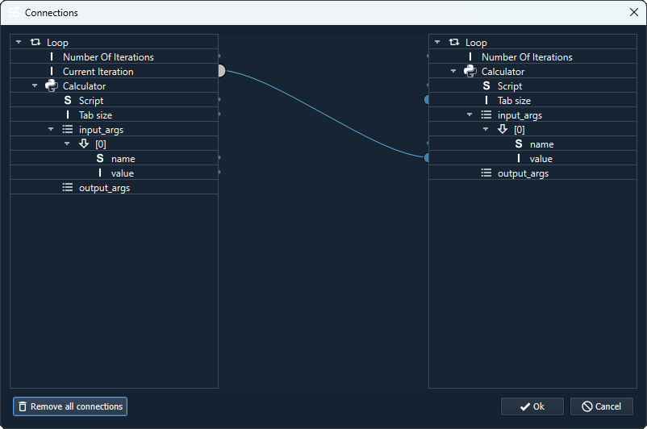

.. _label_section_connection_editor:

Connection Editor
-----------------

By right-clicking on a process element (both calculators and tasks), a context menu appears in which the entry *Connection Editor* can be found.
This entry can be used to open the editor for this workflow.

Propety values can be passed on from one process element to another here.
Only identical types can be connected with each other.
Values from the left-hand side are passed on to the properties on the right-hand side.
To do this, click on one of the semicircles on the properties. The characters in the lines (e.g. a stylised I) already indicate the type (here an integer value).
When the semicircle is clicked, a compatible connection can be selected on the target page using drag n drop. 
To help, all incompatible connections are displayed smaller, all compatible ones larger.

.. image:: ../images/Workflows_Connection_editor_bright.png
   :align: center
   :alt: Connection Editor
   :class: only-light
   

   
In GTlab there are properties that can only be read but not set by the user (e.g. result values from processes). 
Accordingly, these only appear on the left-hand side in the Connection Editor.   
   
Right-click on a connection to open a context menu with the option to remove the connection.  
If you right-click on a process element in the overviews on the right and left, 
you can also delete all connections of this process element using the context menu.
All connections in the workflow can also be removed using a button at the bottom left of the window.