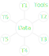

.. _label_hub_spoke:

Hub-Spoke Workflows
===================

GTlab’s data processing is based on a **hub–spoke architecture**.  

- The **hub** represents the central data repository, where all project data is stored and managed.  
- The **spokes** are the individual tools that read, analyze, and process this data.  

Because all tools access the same project data and data models, they **“speak the same language.”** 
This eliminates the need for custom interfaces or converters between tools, ensuring consistent, reliable, and efficient data exchange.

This concept can be visualized as a wheel: the hub contains the data, while the spokes represent the connected tools that interact with it.

   

.. toctree::
   :hidden:

   hub-spoke/01_creating_a_workflow
   hub-spoke/02_tasks_calculators
   hub-spoke/03_connection_editor
   hub-spoke/04_process_queu

In a hub–spoke workflow, all process elements act on the **project data**, potentially modifying it one after another.

Hierarchy of Workflow Elements
------------------------------

Within this architecture, workflow elements are organized hierarchically:

- :ref:`label_section_tasks`: Higher-level elements that coordinate the process flow.  
  Typical examples include **loops**, **optimizers**, and **design of experiments (DOEs)**.  

- :ref:`label_section_calculators`: Lower-level elements that perform the actual **simulations**, **data modifications**, or other **computations**.
  
Data Handling
-------------

During workflow execution, data communication takes place on a **temporary copy of the project data**, which acts as the central information point.  
Each process element modifies this temporary copy as the workflow progresses.

If the workflow completes successfully, the temporary modifications are then **applied back to the project data**.

If additional workflow-related parameters need to be exchanged between different calculators, this can be achieved via the :ref:`Connection Editor <label_section_connection_editor>`.  
For example, in a looped workflow, the iteration step can be passed on to subsequent elements using this editor.

The following section illustrates :ref:`how to build a workflow <label_section_how_to_buid_process>`.